# AY-3-8910シミュレータ ソフトウェア詳細設計書

## (SW301) プログラムユニット機能/構成設計書

### 1. プログラムユニット分割

AY-3-8910シミュレータを実装可能なプログラムユニットに分割し、各ユニットの責務と構成を定義する。

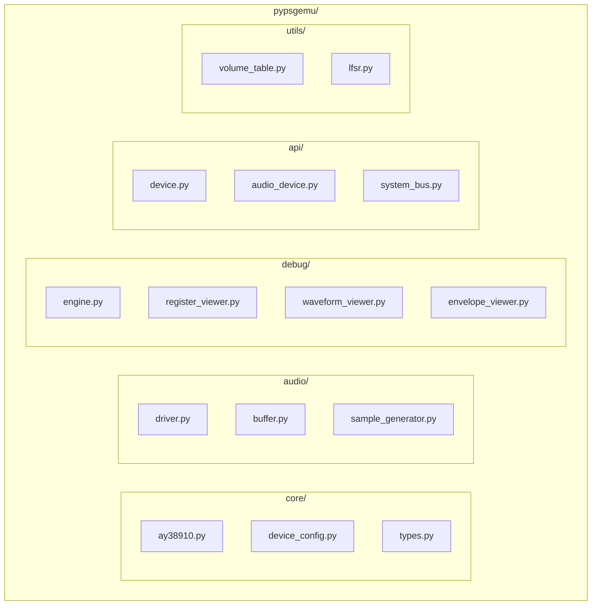

#### 1.1 コアエミュレーション層

| プログラムユニット | ファイル名 | 責務 | 主要クラス |
|-------------------|------------|------|------------|
| AY38910Core | `core/ay38910.py` | AY-3-8910の内部ロジック実装 | `AY38910Core` |
| ToneGenerator | `core/tone_generator.py` | 3つのトーンジェネレータ管理 | `ToneGenerator` |
| NoiseGenerator | `core/noise_generator.py` | 17ビットLFSRノイズ生成 | `NoiseGenerator` |
| EnvelopeGenerator | `core/envelope_generator.py` | エンベロープ形状生成 | `EnvelopeGenerator` |
| Mixer | `core/mixer.py` | チャンネルミキシング | `Mixer` |
| VolumeTable | `utils/volume_table.py` | 対数DAC変換 | `VolumeTable` |

#### 1.2 音声出力層

| プログラムユニット | ファイル名 | 責務 | 主要クラス |
|-------------------|------------|------|------------|
| AudioDriver | `audio/driver.py` | sounddevice統合 | `AudioDriver` |
| AudioBuffer | `audio/buffer.py` | サンプルバッファ管理 | `AudioBuffer` |
| SampleGenerator | `audio/sample_generator.py` | サンプル生成ロジック | `SampleGenerator` |

#### 1.3 デバッグ層

| プログラムユニット | ファイル名 | 責務 | 主要クラス |
|-------------------|------------|------|------------|
| DebugEngine | `debug/engine.py` | 実行制御・状態検査 | `DebugEngine` |
| RegisterViewer | `debug/register_viewer.py` | レジスタ表示 | `RegisterViewer` |
| WaveformViewer | `debug/waveform_viewer.py` | 波形可視化 | `WaveformViewer` |
| EnvelopeViewer | `debug/envelope_viewer.py` | エンベロープ可視化 | `EnvelopeViewer` |

#### 1.4 API準拠層

| プログラムユニット | ファイル名 | 責務 | 主要クラス |
|-------------------|------------|------|------------|
| DeviceProtocol | `api/device.py` | Deviceプロトコル実装 | `AY38910Device` |
| AudioDeviceProtocol | `api/audio_device.py` | AudioDeviceプロトコル実装 | `AY38910AudioDevice` |
| SystemBus | `api/system_bus.py` | システムバス実装 | `AY38910SystemBus` |

#### 1.5 ユーティリティ層

| プログラムユニット | ファイル名 | 責務 | 主要クラス |
|-------------------|------------|------|------------|
| DeviceConfig | `core/device_config.py` | デバイス設定管理 | `AY38910Config` |
| Types | `core/types.py` | 共通型定義 | `AY38910State`, `AY38910Error` |
| LFSR | `utils/lfsr.py` | LFSR実装 | `LFSR` |

### 2. プログラムユニット間の依存関係

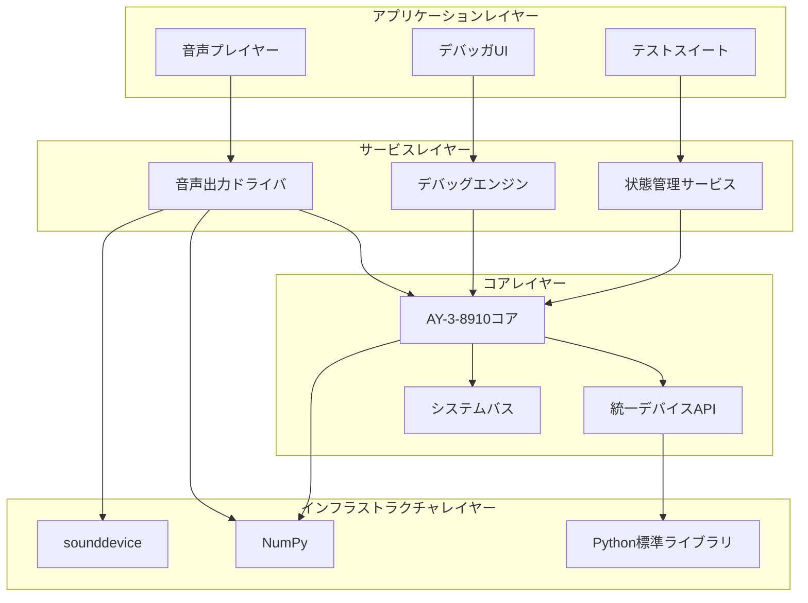

## (SW302) プログラムユニット設計書

### 1. AY38910Core詳細設計

#### 1.1 クラス構造

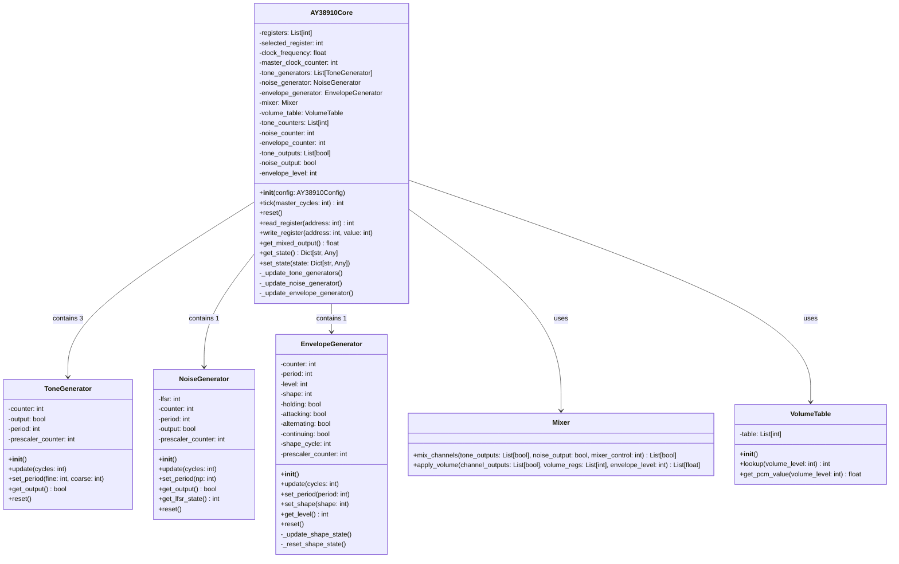

```python
class AY38910Core:
    """AY-3-8910コアエミュレータ"""
    
    def __init__(self, config: AY38910Config):
        # レジスタ状態
        self.registers = [0] * 16  # R0-R15
        self.selected_register = 0
        
        # クロック管理
        self.clock_frequency = config.clock_frequency
        self.master_clock_counter = 0
        
        # ジェネレータインスタンス
        self.tone_generators = [ToneGenerator() for _ in range(3)]
        self.noise_generator = NoiseGenerator()
        self.envelope_generator = EnvelopeGenerator()
        
        # ミキサーとボリュームテーブル
        self.mixer = Mixer()
        self.volume_table = VolumeTable()
        
        # 内部カウンタ
        self.tone_counters = [0] * 3
        self.noise_counter = 0
        self.envelope_counter = 0
        
        # 出力状態
        self.tone_outputs = [False] * 3
        self.noise_output = False
        self.envelope_level = 15
```

#### 1.2 主要メソッド実装

```python
def tick(self, master_cycles: int) -> int:
    """マスタークロックサイクル単位でエミュレーション進行"""
    consumed_cycles = 0
    
    for _ in range(master_cycles):
        # プリスケーラ処理（16分周）
        if self.master_clock_counter % 16 == 0:
            self._update_tone_generators()
            self._update_noise_generator()
        
        # エンベロープ更新（256分周）
        if self.master_clock_counter % 256 == 0:
            self._update_envelope_generator()
        
        self.master_clock_counter += 1
        consumed_cycles += 1
        
    return consumed_cycles

def _update_tone_generators(self):
    """トーンジェネレータ更新"""
    for i, gen in enumerate(self.tone_generators):
        # レジスタから周期値を取得
        fine = self.registers[i * 2]  # R0, R2, R4
        coarse = self.registers[i * 2 + 1]  # R1, R3, R5
        gen.set_period(fine, coarse)
        
        # カウンタ更新
        self.tone_counters[i] += 1
        gen.update(1)
        self.tone_outputs[i] = gen.get_output()

def _update_noise_generator(self):
    """ノイズジェネレータ更新"""
    # R6からノイズ周期を取得
    noise_period = self.registers[6] & 0x1F
    self.noise_generator.set_period(noise_period)
    
    # カウンタ更新
    self.noise_counter += 1
    self.noise_generator.update(1)
    self.noise_output = self.noise_generator.get_output()

def _update_envelope_generator(self):
    """エンベロープジェネレータ更新"""
    # R11, R12からエンベロープ周期を取得
    fine = self.registers[11]
    coarse = self.registers[12]
    period = (coarse << 8) | fine
    self.envelope_generator.set_period(period)
    
    # R13から形状制御を取得
    shape = self.registers[13] & 0x0F
    self.envelope_generator.set_shape(shape)
    
    # カウンタ更新
    self.envelope_counter += 1
    self.envelope_generator.update(1)
    self.envelope_level = self.envelope_generator.get_level()

def get_mixed_output(self) -> float:
    """3チャンネルの出力をミックスして最終出力を生成"""
    mixer_control = self.registers[7]
    outputs = []
    
    for channel in range(3):
        # トーン出力
        tone_enabled = not (mixer_control & (1 << channel))
        tone_output = self.tone_outputs[channel] if tone_enabled else False
        
        # ノイズ出力
        noise_enabled = not (mixer_control & (1 << (channel + 3)))
        noise_output = self.noise_output if noise_enabled else False
        
        # チャンネル出力（NAND論理）
        channel_output = not (tone_output and noise_output)
        
        # 音量制御
        volume_reg = self.registers[8 + channel]
        volume_mode = bool(volume_reg & 0x10)
        volume_level = volume_reg & 0x0F
        
        if volume_mode:
            # エンベロープモード
            final_volume = self.envelope_level
        else:
            # 固定音量モード
            final_volume = volume_level
        
        # ボリュームテーブルでPCM値に変換
        pcm_value = self.volume_table.lookup(final_volume)
        
        # チャンネル出力と音量を適用
        if channel_output:
            outputs.append(pcm_value)
        else:
            outputs.append(0.0)
    
    # 3チャンネルを合計（-1.0〜1.0の範囲に正規化）
    total_output = sum(outputs)
    return max(-1.0, min(1.0, total_output / 65535.0))
```

### 2. ToneGenerator詳細設計

**設計方針（アーキテクチャ仕様書準拠）:**
- プリスケーラ（16分周）はコアエミュレータ側で管理
- `update(cycles)` の `cycles` は「プリスケーラ済み」のサイクル数
- ジェネレータはシンプルなダウンカウンタとフリップフロップのみ実装

#### 2.1 クラス構造

```python
class ToneGenerator:
    """12ビットトーンジェネレータ"""

    def __init__(self):
        self.counter = 0
        self.output = False
        self.period = 1  # TP値（0の場合は1にクランプ）
        # 注: prescaler_counterはコア側で管理するため不要
```

#### 2.2 主要メソッド実装

```python
def update(self, cycles: int):
    """プリスケーラ済みサイクル数分のトーン生成

    注意: cyclesは「16分周済み」のサイクル数です。
    コアエミュレータが16マスタークロックに1回呼び出します。
    """
    for _ in range(cycles):
        self.counter -= 1

        if self.counter <= 0:
            self.output = not self.output
            self.counter = self.period

def set_period(self, fine: int, coarse: int):
    """12ビット周期設定"""
    tp = (coarse << 8) | fine
    self.period = max(1, tp)  # TP=0を1にクランプ

def get_output(self) -> bool:
    """1ビット出力取得"""
    return self.output

def reset(self):
    """ジェネレータリセット"""
    self.counter = 0
    self.output = False
    self.period = 1
```

### 3. NoiseGenerator詳細設計

**設計方針（アーキテクチャ仕様書準拠）:**
- プリスケーラ（16分周）はコアエミュレータ側で管理
- `update(cycles)` の `cycles` は「プリスケーラ済み」のサイクル数
- ジェネレータは17ビットLFSRとダウンカウンタのみ実装

#### 3.1 クラス構造

```python
class NoiseGenerator:
    """17ビットLFSRノイズジェネレータ"""

    def __init__(self):
        self.lfsr = 0x1FFFF  # 17ビット初期値
        self.counter = 0
        self.period = 1
        self.output = False
        # 注: prescaler_counterはコア側で管理するため不要
```

#### 3.2 主要メソッド実装

```python
def update(self, cycles: int):
    """プリスケーラ済みサイクル数分のLFSR更新

    注意: cyclesは「16分周済み」のサイクル数です。
    コアエミュレータが16マスタークロックに1回呼び出します。
    """
    for _ in range(cycles):
        self.counter -= 1

        if self.counter <= 0:
            # LFSR更新: new_bit = bit(0) ^ bit(3)
            new_bit = (self.lfsr & 1) ^ ((self.lfsr >> 3) & 1)
            self.lfsr = (self.lfsr >> 1) | (new_bit << 16)
            self.output = bool(self.lfsr & 1)
            self.counter = self.period

def set_period(self, np: int):
    """5ビットノイズ周期設定"""
    self.period = max(1, np)  # NP=0を1にクランプ

def get_output(self) -> bool:
    """1ビットノイズ出力"""
    return self.output

def get_lfsr_state(self) -> int:
    """LFSR状態取得（デバッグ用）"""
    return self.lfsr

def reset(self):
    """ジェネレータリセット"""
    self.lfsr = 0x1FFFF
    self.counter = 0
    self.period = 1
    self.output = False
```

### 4. EnvelopeGenerator詳細設計

**設計方針（アーキテクチャ仕様書準拠）:**
- プリスケーラ（256分周）はコアエミュレータ側で管理
- `update(cycles)` の `cycles` は「プリスケーラ済み」のサイクル数
- ジェネレータは16ビットダウンカウンタと4ビット音量レベル、形状制御のみ実装

#### 4.1 クラス構造

```python
class EnvelopeGenerator:
    """エンベロープジェネレータ"""

    def __init__(self):
        self.counter = 0
        self.period = 1
        self.level = 15  # 4ビット音量レベル
        self.shape = 0   # R13の形状制御

        # 形状制御フラグ
        self.holding = False
        self.attacking = False
        self.alternating = False
        self.continuing = False

        # 内部状態
        self.shape_cycle = 0
        # 注: prescaler_counterはコア側で管理するため不要
```

#### 4.2 主要メソッド実装

```python
def update(self, cycles: int):
    """プリスケーラ済みサイクル数分のエンベロープ更新

    注意: cyclesは「256分周済み」のサイクル数です。
    コアエミュレータが256マスタークロックに1回呼び出します。
    """
    for _ in range(cycles):
        self.counter -= 1

        if self.counter <= 0:
            if not self.holding:
                if self.attacking:
                    self.level = min(15, self.level + 1)
                else:
                    self.level = max(0, self.level - 1)

            # 形状制御ロジック
            self._update_shape_state()
            self.counter = self.period

def _update_shape_state(self):
    """形状状態更新"""
    # R13ビット制御ロジック実装
    cont = bool(self.shape & 0x08)
    att = bool(self.shape & 0x04)
    alt = bool(self.shape & 0x02)
    hold = bool(self.shape & 0x01)
    
    if not cont:
        # 非継続モード
        if not hold:
            if att:
                # アタック→無音
                if self.level >= 15:
                    self.holding = True
            else:
                # 減衰→無音
                if self.level <= 0:
                    self.holding = True
        else:
            # ホールドモード
            self.holding = True
    else:
        # 継続モード
        if alt:
            # 交互モード
            if self.level >= 15:
                self.attacking = False
            elif self.level <= 0:
                self.attacking = True
        else:
            # 単方向モード
            if att:
                if self.level >= 15:
                    self.level = 0  # リセット
            else:
                if self.level <= 0:
                    self.level = 15  # リセット

def set_period(self, period: int):
    """16ビットエンベロープ周期設定"""
    self.period = max(1, period)  # EP=0を1にクランプ

def set_shape(self, shape: int):
    """エンベロープ形状設定"""
    self.shape = shape & 0x0F
    self._reset_shape_state()

def _reset_shape_state(self):
    """形状状態リセット"""
    self.holding = False
    self.attacking = bool(self.shape & 0x04)
    self.alternating = bool(self.shape & 0x02)
    self.continuing = bool(self.shape & 0x08)
    
    if self.attacking:
        self.level = 0
    else:
        self.level = 15

def get_level(self) -> int:
    """4ビット音量レベル取得"""
    return self.level

def reset(self):
    """ジェネレータリセット"""
    self.counter = 0
    self.period = 1
    self.level = 15
    self.shape = 0
    self.holding = False
    self.attacking = False
    self.alternating = False
    self.continuing = False
    self.shape_cycle = 0
    self.prescaler_counter = 0
```

### 5. AudioDriver詳細設計

#### 5.1 クラス構造

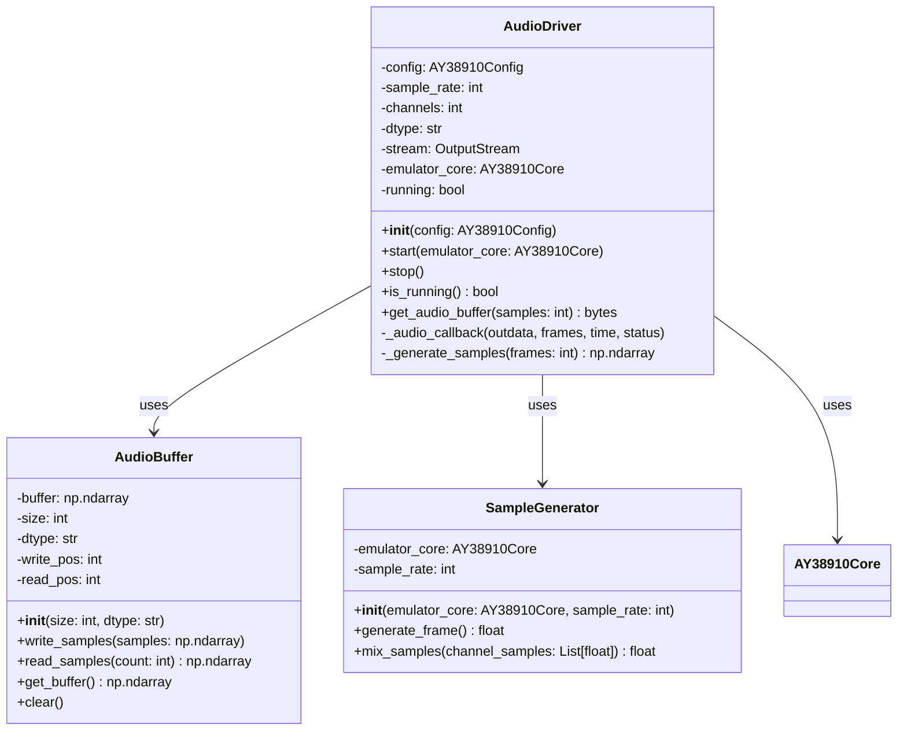

```python
class AudioDriver:
    """音声出力ドライバ"""
    
    def __init__(self, config: AY38910Config):
        self.config = config
        self.sample_rate = config.sample_rate
        self.channels = config.channels
        self.dtype = config.dtype
        self.stream = None
        self.emulator_core = None
        self.running = False
```

#### 5.2 主要メソッド実装

```python
def start(self, emulator_core):
    """音声出力開始"""
    self.emulator_core = emulator_core
    self.running = True
    
    try:
        self.stream = sounddevice.OutputStream(
            samplerate=self.sample_rate,
            channels=self.channels,
            dtype=self.dtype,
            callback=self._audio_callback,
            blocksize=0  # 自動選択
        )
        self.stream.start()
    except Exception as e:
        raise AudioDriverError(f"音声出力開始エラー: {e}")

def stop(self):
    """音声出力停止"""
    self.running = False
    if self.stream:
        self.stream.stop()
        self.stream.close()
        self.stream = None

def _audio_callback(self, outdata, frames, time, status):
    """オーディオコールバック関数"""
    if status:
        print(f"Audio callback status: {status}")
    
    try:
        # フレーム数分のサンプル生成
        samples = self._generate_samples(frames)
        outdata[:] = samples.reshape(-1, 1)
    except Exception as e:
        print(f"Audio callback error: {e}")
        outdata[:] = 0

def _generate_samples(self, frames: int) -> np.ndarray:
    """サンプル生成"""
    samples = np.zeros(frames, dtype=np.float32)
    
    for i in range(frames):
        # 1サンプル生成に必要なサイクル数
        cycles_per_sample = int(self.emulator_core.clock_frequency / self.sample_rate)
        
        # エミュレータを1サンプル分進行
        self.emulator_core.tick(cycles_per_sample)
        
        # 3チャンネルの出力をミックス
        sample_value = self.emulator_core.get_mixed_output()
        samples[i] = sample_value
    
    return samples
```

### 6. DebugEngine詳細設計

#### 6.1 クラス構造

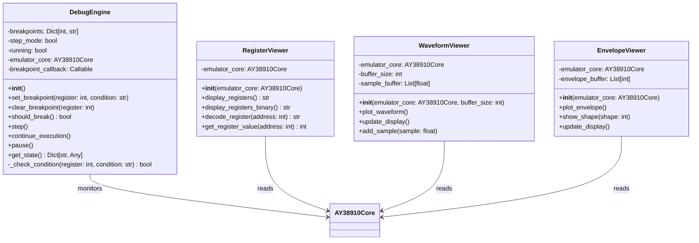

```python
class DebugEngine:
    """デバッグエンジン"""
    
    def __init__(self):
        self.breakpoints = {}  # {register: condition}
        self.step_mode = False
        self.running = True
        self.emulator_core = None
        self.breakpoint_callback = None
```

#### 6.2 主要メソッド実装

```python
def set_breakpoint(self, register: int, condition: str = None):
    """ブレークポイント設定"""
    if 0 <= register <= 15:
        self.breakpoints[register] = condition
    else:
        raise RegisterAccessError(f"無効なレジスタ番号: {register}")

def clear_breakpoint(self, register: int):
    """ブレークポイントクリア"""
    if register in self.breakpoints:
        del self.breakpoints[register]

def should_break(self) -> bool:
    """ブレークポイント条件チェック"""
    if self.step_mode:
        return True
        
    # レジスタ書き込み時のブレークポイントチェック
    for reg, condition in self.breakpoints.items():
        if self._check_condition(reg, condition):
            return True
    
    return False

def _check_condition(self, register: int, condition: str) -> bool:
    """ブレークポイント条件チェック"""
    if not condition:
        return True  # 無条件ブレークポイント
    
    try:
        # 条件式を評価（例: "value == 0xFF", "value > 100"）
        value = self.emulator_core.registers[register]
        return eval(condition, {"value": value, "__builtins__": {}})
    except:
        return False

def step(self):
    """ステップ実行"""
    self.step_mode = True
    self.running = True

def continue_execution(self):
    """実行継続"""
    self.step_mode = False
    self.running = True

def pause(self):
    """実行一時停止"""
    self.running = False

def get_state(self) -> Dict[str, Any]:
    """デバッグ状態取得"""
    return {
        'breakpoints': self.breakpoints.copy(),
        'step_mode': self.step_mode,
        'running': self.running
    }
```

## (SW303) プログラムユニット・インタフェース設計書

### メインエミュレーションループシーケンス図

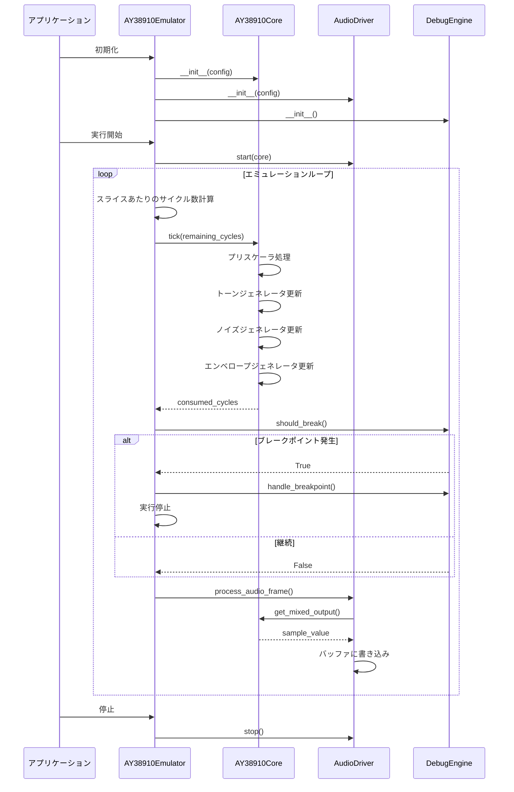

### 1. コアエミュレーション層インタフェース

#### 1.1 AY38910Coreインタフェース

```python
class AY38910Core:
    """AY-3-8910コアエミュレータ"""
    
    def __init__(self, config: AY38910Config) -> None:
        """コアエミュレータ初期化"""
        pass
    
    def tick(self, master_cycles: int) -> int:
        """マスタークロックサイクル単位でエミュレーション進行"""
        pass
    
    def reset(self) -> None:
        """エミュレータリセット"""
        pass
    
    def read_register(self, address: int) -> int:
        """レジスタ読み込み"""
        pass
    
    def write_register(self, address: int, value: int) -> None:
        """レジスタ書き込み"""
        pass
    
    def get_mixed_output(self) -> float:
        """3チャンネルの出力をミックスして最終出力を生成"""
        pass
    
    def get_state(self) -> Dict[str, Any]:
        """内部状態取得"""
        pass
    
    def set_state(self, state: Dict[str, Any]) -> None:
        """内部状態設定"""
        pass
```

#### 1.2 ToneGeneratorインタフェース

```python
class ToneGenerator:
    """12ビットトーンジェネレータ"""
    
    def __init__(self) -> None:
        """トーンジェネレータ初期化"""
        pass
    
    def update(self, cycles: int) -> None:
        """指定サイクル数分のトーン生成"""
        pass
    
    def set_period(self, fine: int, coarse: int) -> None:
        """12ビット周期設定"""
        pass
    
    def get_output(self) -> bool:
        """1ビット出力取得"""
        pass
    
    def reset(self) -> None:
        """ジェネレータリセット"""
        pass
```

#### 1.3 NoiseGeneratorインタフェース

```python
class NoiseGenerator:
    """17ビットLFSRノイズジェネレータ"""
    
    def __init__(self) -> None:
        """ノイズジェネレータ初期化"""
        pass
    
    def update(self, cycles: int) -> None:
        """LFSR更新"""
        pass
    
    def set_period(self, np: int) -> None:
        """5ビットノイズ周期設定"""
        pass
    
    def get_output(self) -> bool:
        """1ビットノイズ出力"""
        pass
    
    def get_lfsr_state(self) -> int:
        """LFSR状態取得（デバッグ用）"""
        pass
    
    def reset(self) -> None:
        """ジェネレータリセット"""
        pass
```

#### 1.4 EnvelopeGeneratorインタフェース

```python
class EnvelopeGenerator:
    """エンベロープジェネレータ"""
    
    def __init__(self) -> None:
        """エンベロープジェネレータ初期化"""
        pass
    
    def update(self, cycles: int) -> None:
        """エンベロープ更新"""
        pass
    
    def set_period(self, period: int) -> None:
        """16ビットエンベロープ周期設定"""
        pass
    
    def set_shape(self, shape: int) -> None:
        """エンベロープ形状設定"""
        pass
    
    def get_level(self) -> int:
        """4ビット音量レベル取得"""
        pass
    
    def reset(self) -> None:
        """ジェネレータリセット"""
        pass
```

### 2. 音声出力層インタフェース

### 音声出力コールバックシーケンス図

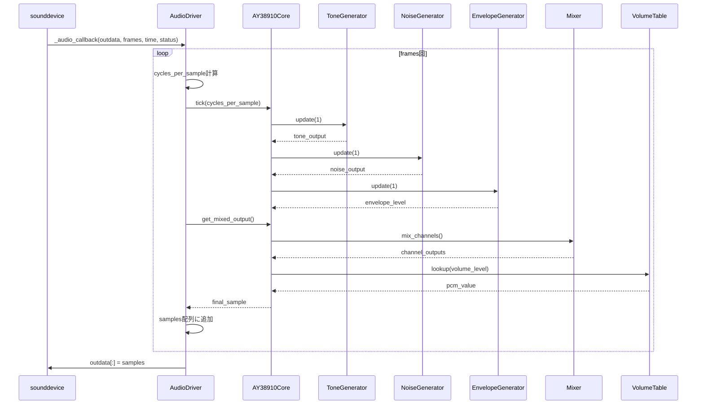

#### 2.1 AudioDriverインタフェース

```python
class AudioDriver:
    """音声出力ドライバ"""
    
    def __init__(self, config: AY38910Config) -> None:
        """音声ドライバ初期化"""
        pass
    
    def start(self, emulator_core: AY38910Core) -> None:
        """音声出力開始"""
        pass
    
    def stop(self) -> None:
        """音声出力停止"""
        pass
    
    def is_running(self) -> bool:
        """音声出力状態確認"""
        pass
    
    def get_audio_buffer(self, samples: int) -> bytes:
        """オーディオバッファ取得"""
        pass
```

#### 2.2 AudioBufferインタフェース

```python
class AudioBuffer:
    """オーディオバッファ管理"""
    
    def __init__(self, size: int, dtype: str = 'float32') -> None:
        """バッファ初期化"""
        pass
    
    def write_samples(self, samples: np.ndarray) -> None:
        """サンプル書き込み"""
        pass
    
    def read_samples(self, count: int) -> np.ndarray:
        """サンプル読み込み"""
        pass
    
    def get_buffer(self) -> np.ndarray:
        """バッファ全体取得"""
        pass
    
    def clear(self) -> None:
        """バッファクリア"""
        pass
```

### 3. デバッグ層インタフェース

### デバッグ機能シーケンス図

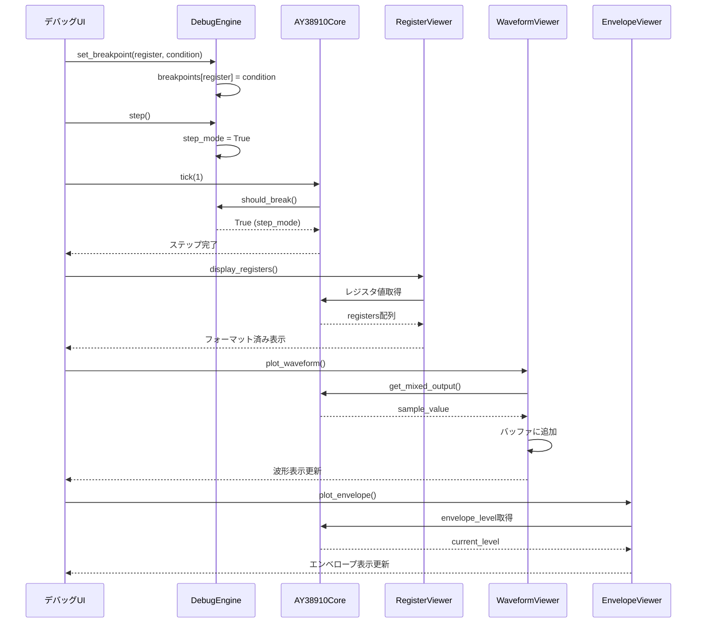

#### 3.1 DebugEngineインタフェース

```python
class DebugEngine:
    """デバッグエンジン"""
    
    def __init__(self) -> None:
        """デバッグエンジン初期化"""
        pass
    
    def set_breakpoint(self, register: int, condition: str = None) -> None:
        """ブレークポイント設定"""
        pass
    
    def clear_breakpoint(self, register: int) -> None:
        """ブレークポイントクリア"""
        pass
    
    def should_break(self) -> bool:
        """ブレークポイント条件チェック"""
        pass
    
    def step(self) -> None:
        """ステップ実行"""
        pass
    
    def continue_execution(self) -> None:
        """実行継続"""
        pass
    
    def pause(self) -> None:
        """実行一時停止"""
        pass
    
    def get_state(self) -> Dict[str, Any]:
        """デバッグ状態取得"""
        pass
```

#### 3.2 RegisterViewerインタフェース

```python
class RegisterViewer:
    """レジスタ表示"""
    
    def __init__(self, emulator_core: AY38910Core) -> None:
        """レジスタビューア初期化"""
        pass
    
    def display_registers(self) -> str:
        """レジスタ表示（16進数）"""
        pass
    
    def display_registers_binary(self) -> str:
        """レジスタ表示（2進数）"""
        pass
    
    def decode_register(self, address: int) -> str:
        """レジスタデコード表示"""
        pass
    
    def get_register_value(self, address: int) -> int:
        """レジスタ値取得"""
        pass
```

### 4. API準拠層インタフェース

### レジスタ書き込みシーケンス図

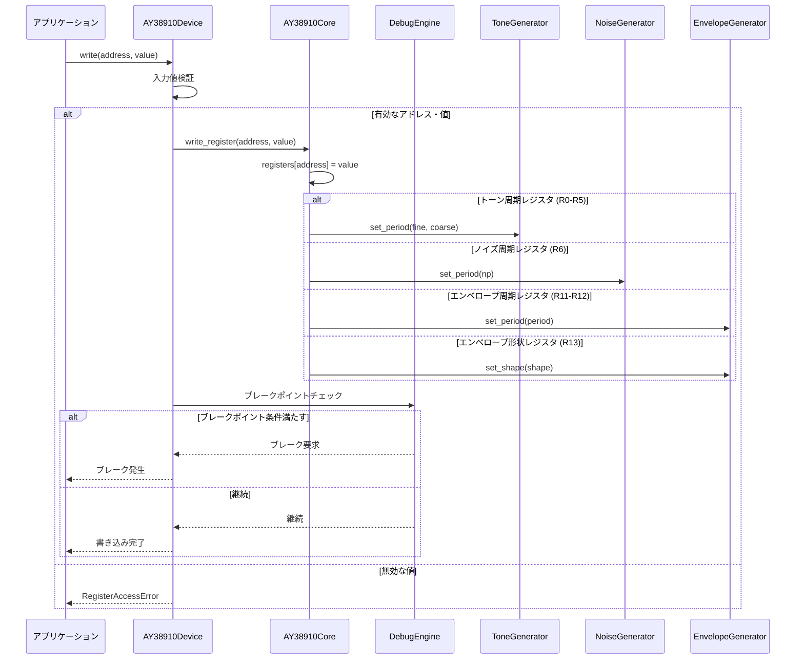

#### 4.1 Deviceプロトコル実装

```python
class AY38910Device(Device, AudioDevice):
    """AY-3-8910デバイス実装"""
    
    def __init__(self, config: AY38910Config) -> None:
        """デバイス初期化"""
        pass
    
    @property
    def name(self) -> str:
        """デバイス名取得"""
        pass
    
    def reset(self) -> None:
        """デバイスリセット"""
        pass
    
    def tick(self, master_cycles: int) -> int:
        """Tick駆動実行"""
        pass
    
    def read(self, address: int) -> int:
        """レジスタ読み込み"""
        pass
    
    def write(self, address: int, value: int) -> None:
        """レジスタ書き込み"""
        pass
    
    def get_state(self) -> Dict[str, Any]:
        """状態シリアライズ"""
        pass
    
    def set_state(self, state: Dict[str, Any]) -> None:
        """状態復元"""
        pass
    
    def get_audio_buffer(self, samples: int) -> bytes:
        """オーディオバッファ取得"""
        pass
```

#### 4.2 SystemBusインタフェース

```python
class AY38910SystemBus(SystemBus):
    """AY-3-8910システムバス実装"""
    
    def __init__(self) -> None:
        """システムバス初期化"""
        pass
    
    def map_device(self, device: Device, base_address: int, size: int) -> None:
        """デバイスマッピング"""
        pass
    
    def read(self, address: int) -> int:
        """システムアドレス読み込み"""
        pass
    
    def write(self, address: int, value: int) -> None:
        """システムアドレス書き込み"""
        pass
    
    def _resolve_address(self, address: int) -> Tuple[Optional[Device], int]:
        """アドレス解決"""
        pass
```

### 5. データ型インタフェース

### 状態保存・復元シーケンス図

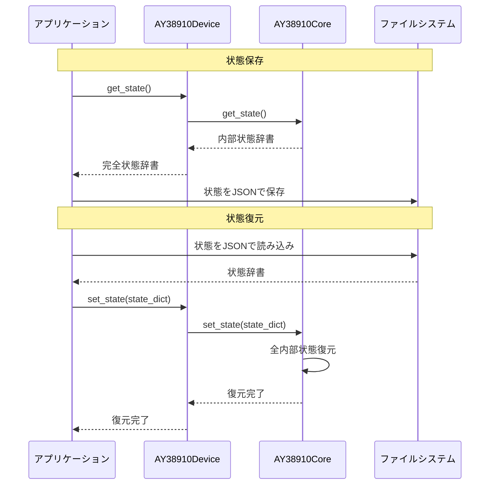

#### 5.1 設定クラス

```python
@dataclass
class AY38910Config(DeviceConfig):
    """AY-3-8910設定"""
    device_id: str = "ay38910"
    clock_frequency: float = 2000000.0  # 2MHz
    sample_rate: int = 44100
    channels: int = 1
    dtype: str = 'float32'
    
    # エミュレーション設定
    enable_debug: bool = False
    enable_visualization: bool = False
    breakpoint_registers: List[int] = field(default_factory=list)
```

#### 5.2 状態クラス

```python
@dataclass
class AY38910State:
    """AY-3-8910内部状態"""
    # レジスタ状態
    registers: List[int] = field(default_factory=lambda: [0] * 16)
    selected_register: int = 0
    
    # 内部カウンタ
    master_clock_counter: int = 0
    tone_counters: List[int] = field(default_factory=lambda: [0] * 3)
    noise_counter: int = 0
    envelope_counter: int = 0
    
    # ジェネレータ状態
    tone_outputs: List[bool] = field(default_factory=lambda: [False] * 3)
    noise_output: bool = False
    envelope_level: int = 15
    
    # LFSR状態
    lfsr_value: int = 0x1FFFF
    
    # エンベロープ状態
    envelope_holding: bool = False
    envelope_attacking: bool = False
    envelope_alternating: bool = False
    envelope_continuing: bool = False
```

#### 5.3 エラークラス

```python
class AY38910Error(Exception):
    """AY-3-8910エミュレータ基本例外"""
    pass

class RegisterAccessError(AY38910Error):
    """レジスタアクセスエラー"""
    pass

class InvalidValueError(AY38910Error):
    """無効な値エラー"""
    pass

class AudioDriverError(AY38910Error):
    """音声ドライバエラー"""
    pass
```

## (SW304) メモリ使用量（メモ）

### 1. 静的メモリ使用量

| コンポーネント | サイズ | 説明 |
|----------------|--------|------|
| レジスタ配列 | 16バイト | R0-R15の8ビットレジスタ |
| 内部カウンタ | 32バイト | 各種カウンタ（master_clock_counter, tone_counters等） |
| LFSR状態 | 4バイト | 17ビットLFSR値 |
| ボリュームテーブル | 64バイト | 対数DACテーブル（16×4バイト） |
| 設定データ | 128バイト | デバイス設定（AY38910Config） |
| ジェネレータ状態 | 48バイト | 3×ToneGenerator + NoiseGenerator + EnvelopeGenerator |
| **小計** | **292バイト** | **基本データ** |

### 2. 動的メモリ使用量

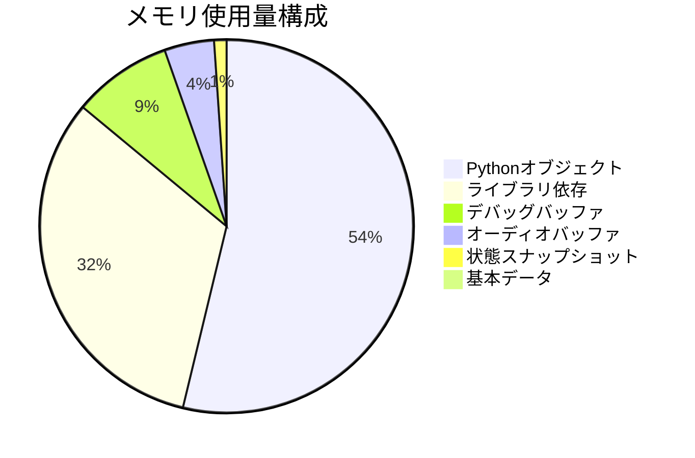

| コンポーネント | サイズ | 説明 |
|----------------|--------|------|
| オーディオバッファ | 4KB | 1024サンプル×4バイト（float32） |
| デバッグバッファ | 8KB | 波形表示用バッファ |
| Pythonオブジェクト | 50KB | オーバーヘッド（メタデータ、参照等） |
| ライブラリ依存 | 30KB | sounddevice, NumPy |
| 状態スナップショット | 1KB | セーブステート用バッファ |
| **小計** | **93KB** | **動的データ** |

### 3. スタック使用量

| 関数 | 最大スタックサイズ | 説明 |
|------|-------------------|------|
| `tick()` | 256バイト | メインエミュレーションループ |
| `_update_tone_generators()` | 128バイト | トーンジェネレータ更新 |
| `_update_noise_generator()` | 64バイト | ノイズジェネレータ更新 |
| `_update_envelope_generator()` | 128バイト | エンベロープジェネレータ更新 |
| `get_mixed_output()` | 192バイト | ミキシング処理 |
| `_audio_callback()` | 512バイト | オーディオコールバック |
| **最大スタック使用量** | **512バイト** | **同時実行時** |

### 4. 総メモリ使用量

- **基本構成**: 292バイト + 93KB ≈ 93KB
- **デバッグ機能込み**: 93KB + 20KB ≈ 113KB
- **最大見積もり**: 150KB
- **目標100MB以内**: ✅（余裕度: 99.85%）

### 5. メモリ最適化指針

#### 5.1 メモリ効率化

1. **オブジェクトプール**: 頻繁に作成・破棄されるオブジェクトの再利用
2. **バッファ再利用**: オーディオバッファの循環使用
3. **遅延初期化**: 必要時のみオブジェクト作成

#### 5.2 メモリ監視

1. **使用量監視**: 実行時メモリ使用量の監視
2. **リーク検出**: メモリリークの検出と報告
3. **ガベージコレクション**: Python GCの最適化

この詳細設計により、AY-3-8910シミュレータは要求仕様を満たしつつ、効率的で保守性の高い実装が可能になります。各プログラムユニットは明確な責務を持ち、疎結合な設計により独立したテストと保守が可能です。
