# AY-3-8910 プログラマブルサウンドジェネレータ: エミュレータ要件定義書

## 第1章: システムアーキテクチャと設計原則

### 1.1. プロジェクト概要

本文書は、Python言語で実装されるGeneral Instrument社製AY-3-8910プログラマブルサウンドジェネレータ（PSG）の、高忠実度ソフトウェアエミュレータに関する技術要件を定義するものである。本システムは、サイクル精度を重視したコアエミュレーションエンジン、リアルタイム音声出力ドライバ、そして統合デバッグスイートという3つの主要コンポーネントから構成される。主要目的は、サウンド再生の正確性と、分析・開発目的での動作の透明性を両立させたリファレンス実装を創出することにある。

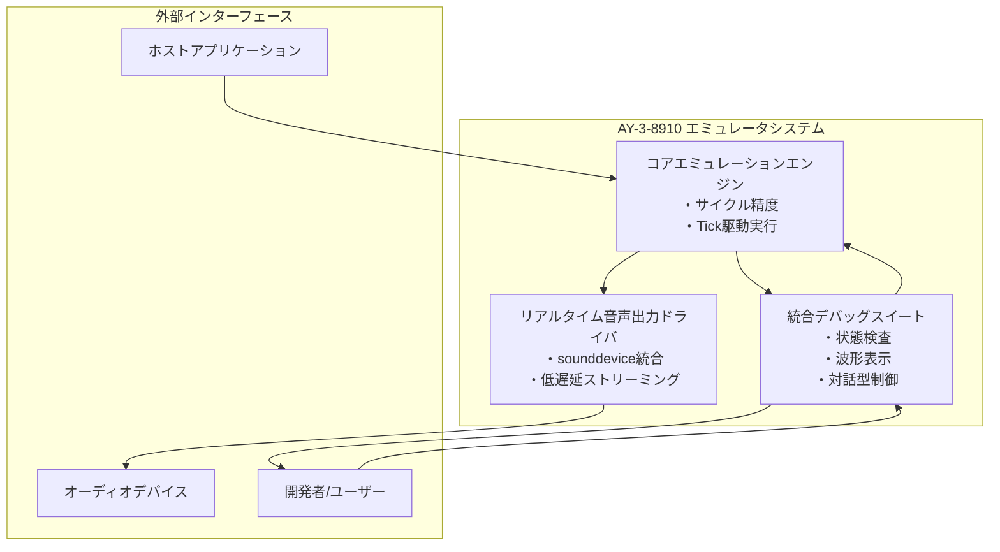

### 1.2. コアアーキテクチャモデル

エミュレータの設計は、明瞭性、テスト容易性、拡張性を確保するため、現代的かつモジュール化された一連の原則に準拠する。これらの原則は、ハードウェアエミュレーションにおける共通の設計パターンに基づいている。

#### 1.2.1. Tick駆動実行モデル

**要件:** エミュレートされるPSGの全状態は、単一の離散的な関数 `tick()` によって遷移させなければならない。この関数は、PSGコアにとってのマスタークロック1サイクル分の経過を表現する。

**詳細:** エミュレータは内部にマスタークロックカウンタを保持する。`tick()` 関数は、外部ドライバ（例: 音声生成ループ）から、エミュレート対象チップのクロック周波数（例: 2MHz）に相当する頻度で呼び出される。トーンジェネレータ、ノイズジェネレータ、エンベロープジェネレータのすべての内部カウンタは、この `tick()` 関数内でのみデクリメントまたは更新される。物理的なハードウェアでは、すべてのサウンド生成コンポーネントが同一のクロックソースによって並列に駆動されるが、このモデルはその厳密な相対的タイミング関係を完全に同期させることを保証する [1, 2]。

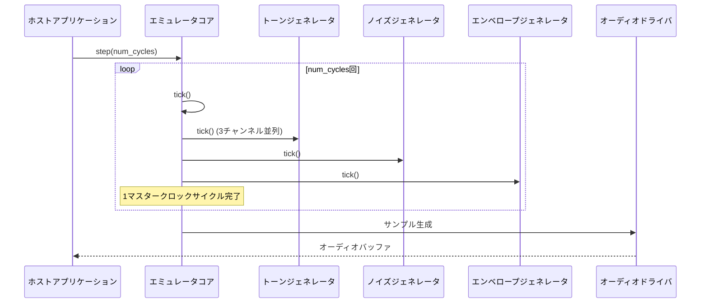

**Tick駆動実行フロー:**

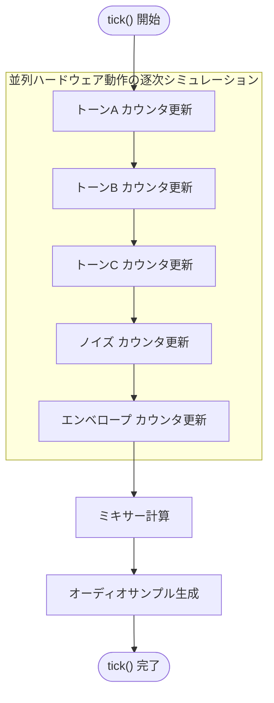

このTick駆動モデルは、エミュレーションの忠実度を確保する上で中心的な役割を果たす。AY-3-8910は、マスタークロック入力によって状態が遷移する有限状態マシンである [1]。単純な命令ベースやイベントベースのモデルでは、3つのトーンジェネレータ、ノイズジェネレータ、エンベロープジェネレータがすべて並列に動作する関係性を正確に捉えることができない。各呼び出しが単一のクロックサイクルを表現する `tick()` 駆動モデルは、この並列ハードウェアの挙動を逐次的なソフトウェア環境でシミュレートするための最も直接的かつ正確な手法である。これにより、例えばチャンネルAの周期が100サイクル、チャンネルBの周期が200サイクルである場合、チャンネルBが1つの矩形波を生成する間に、チャンネルAが正確に2つの完全な矩形波を生成することが保証される。このようなサイクルレベルの精度は、正確な位相関係に依存するチップチューン特有の音響効果を再現するために不可欠である。

#### 1.2.2. 統一デバイスAPI

本項では、ホストアプリケーションがエミュレータを制御するための公開インターフェースを定義する。

**要件:** エミュレータは、`AY38910_Emulator`のような名前のPythonクラスとしてカプセル化されるものとする。このクラスは、ハードウェアへのアクセスを模倣した、以下のコアメソッドを提供しなければならない。

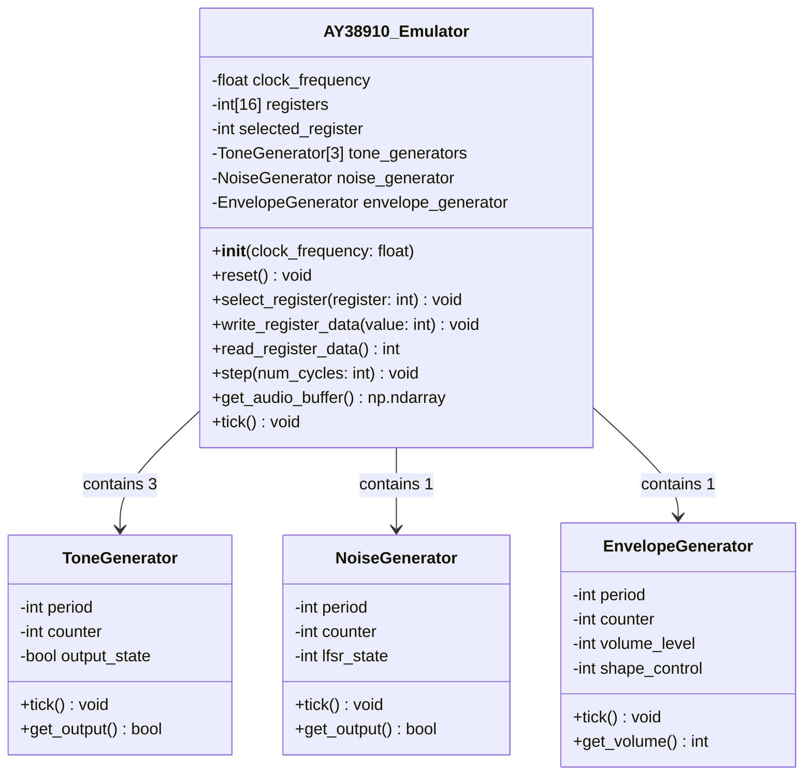

**メソッド仕様:**
*   `__init__(self, clock_frequency: float)`: 指定されたマスタークロック周波数でエミュレータを初期化するコンストラクタ。
*   `reset(self)`: エミュレータの状態をリセットし、すべてのレジスタをゼロクリアする。
*   `select_register(self, register: int)`: 次の読み書き操作の対象となるレジスタを選択する。`register`は0から15の整数。
*   `write_register_data(self, value: int)`: 現在選択されているレジスタに8ビットの値を書き込む。`value`は0から255の整数。
*   `read_register_data(self) -> int`: 現在選択されているレジスタから8ビットの値を読み出す。
*   `step(self, num_cycles: int)`: 指定されたマスタークロックサイクル数だけエミュレーションを進行させる。この過程で内部的にオーディオサンプルが生成される。
*   `get_audio_buffer(self) -> np.ndarray`: 直近で生成が完了したオーディオバッファ（NumPy配列）を取得する。

**詳細:** `device_if_api_requirements.md`への準拠

1.2.2.節で定義されたAPIは、基本的な機能仕様を示すものである。最終的な実装は、外部文書`device_if_api_requirements.md`で指定されたインターフェースおよび設計パターンに完全に準拠するように適合またはラップされなければならない。これには、メソッドのシグネチャ、データ型、エラーハンドリングのプロトコルが含まれる。

## 第2章: AY-3-8910 コアエミュレーション仕様

### 2.1. 内部状態とレジスタマップ

**要件:** エミュレータは、チップの状態を定義する16個の内部8ビットレジスタを正確にモデル化しなければならない。すべてのレジスタは読み書き可能でなければならない。

**詳細:** 内部状態は、16バイトのレジスタ配列に加え、トーン、ノイズ、エンベロープの各カウンタ、およびLFSRの現在値などの内部状態変数から構成される。

**表 2.1: AY-3-8910 レジスタマップ**

この表は、すべてのプログラミングおよびデバッグ活動における決定的なリファレンスとして機能する。複数のデータシートやマニュアルに散在する情報を、単一の明確な情報源に集約するものである。初期化仕様を完全なものにするため、レジスタ名だけでなく、ビットレイアウトとリセット時の状態（全レジスタで `0x00`）も含まれている [3, 4]。

**レジスタ構成の階層図:**

```mermaid
graph TD
    Root["AY-3-8910 レジスタ (R0-R15)"] --> ToneGroup["トーン制御グループ<br/>R0-R5"]
    Root --> NoiseGroup["ノイズ制御グループ<br/>R6"]
    Root --> MixerGroup["ミキサー制御グループ<br/>R7"]
    Root --> VolumeGroup["音量制御グループ<br/>R8-R10"]
    Root --> EnvGroup["エンベロープ制御グループ<br/>R11-R13"]
    Root --> IOGroup["I/O制御グループ<br/>R14-R15"]
    
    ToneGroup --> R0["R0: Ch.A Fine"]
    ToneGroup --> R1["R1: Ch.A Coarse"]
    ToneGroup --> R2["R2: Ch.B Fine"]
    ToneGroup --> R3["R3: Ch.B Coarse"]
    ToneGroup --> R4["R4: Ch.C Fine"]
    ToneGroup --> R5["R5: Ch.C Coarse"]
    
    NoiseGroup --> R6["R6: ノイズ周期"]
    
    MixerGroup --> R7["R7: ミキサー/IO制御"]
    
    VolumeGroup --> R8["R8: Ch.A 音量"]
    VolumeGroup --> R9["R9: Ch.B 音量"]
    VolumeGroup --> R10["R10: Ch.C 音量"]
    
    EnvGroup --> R11["R11: Env. Fine"]
    EnvGroup --> R12["R12: Env. Coarse"]
    EnvGroup --> R13["R13: Env. 形状"]
    
    IOGroup --> R14["R14: ポートA"]
    IOGroup --> R15["R15: ポートB"]
    
    style ToneGroup fill:#ffcccc
    style NoiseGroup fill:#ccffcc
    style MixerGroup fill:#ccccff
    style VolumeGroup fill:#ffffcc
    style EnvGroup fill:#ffccff
    style IOGroup fill:#ccffff
```

| レジスタ | 名称 | Bit 7 | Bit 6 | Bit 5 | Bit 4 | Bit 3 | Bit 2 | Bit 1 | Bit 0 | リセット値 |
|:---------|:-----|:------|:------|:------|:------|:------|:------|:------|:------|:-----------|
| R0 | チャンネルA トーン周期 (Fine) | D7 | D6 | D5 | D4 | D3 | D2 | D1 | D0 | `0x00` |
| R1 | チャンネルA トーン周期 (Coarse) | - | - | - | - | D3 | D2 | D1 | D0 | `0x00` |
| R2 | チャンネルB トーン周期 (Fine) | D7 | D6 | D5 | D4 | D3 | D2 | D1 | D0 | `0x00` |
| R3 | チャンネルB トーン周期 (Coarse) | - | - | - | - | D3 | D2 | D1 | D0 | `0x00` |
| R4 | チャンネルC トーン周期 (Fine) | D7 | D6 | D5 | D4 | D3 | D2 | D1 | D0 | `0x00` |
| R5 | チャンネルC トーン周期 (Coarse) | - | - | - | - | D3 | D2 | D1 | D0 | `0x00` |
| R6 | ノイズ周期 | - | - | - | D4 | D3 | D2 | D1 | D0 | `0x00` |
| R7 | ミキサー制御 / IOイネーブル | IO B | IO A | Noise C| Noise B| Noise A| Tone C | Tone B | Tone A | `0x00` |
| R8 | チャンネルA 音量 | - | - | - | Mode | D3 | D2 | D1 | D0 | `0x00` |
| R9 | チャンネルB 音量 | - | - | - | Mode | D3 | D2 | D1 | D0 | `0x00` |
| R10 | チャンネルC 音量 | - | - | - | Mode | D3 | D2 | D1 | D0 | `0x00` |
| R11 | エンベロープ周期 (Fine) | D7 | D6 | D5 | D4 | D3 | D2 | D1 | D0 | `0x00` |
| R12 | エンベロープ周期 (Coarse) | D7 | D6 | D5 | D4 | D3 | D2 | D1 | D0 | `0x00` |
| R13 | エンベロープ形状/サイクル | - | - | - | - | Cont | Att | Alt | Hold | `0x00` |
| R14 | I/OポートA データ | D7 | D6 | D5 | D4 | D3 | D2 | D1 | D0 | `0x00` |
| R15 | I/OポートB データ | D7 | D6 | D5 | D4 | D3 | D2 | D1 | D0 | `0x00` |

**レジスタ機能グループ図:**

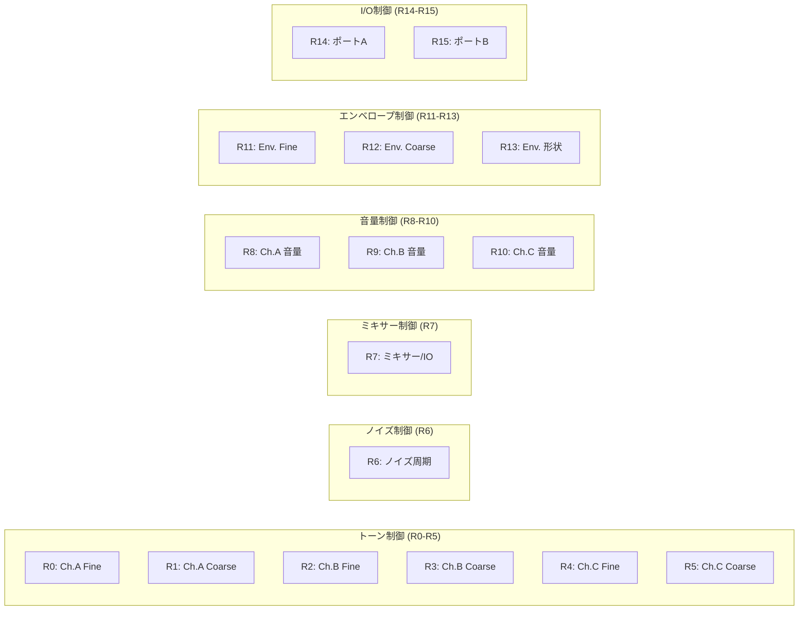

### 2.2. トーンジェネレータ

#### 2.2.1. 動作原理

エミュレータは3つの独立したトーンジェネレータを実装する。各ジェネレータは、12ビットのダウンカウンタと1ビットの出力フリップフロップで構成される。カウンタは、対応するレジスタから読み込まれた12ビットのトーン周期（TP）値でリロードされる。クロックが1 `tick` 進むごとにカウンタはデクリメントされ、ゼロに達すると出力フリップフロップが反転し、カウンタがリロードされる。これにより、周期が $2 \times TP$ マスタークロックサイクルとなる矩形波が生成される。

#### 2.2.2. 周波数制御仕様

各チャンネルの12ビットのトーン周期（TP）は、Coarseレジスタ（R1, R3, R5）の4ビットとFineレジスタ（R0, R2, R4）の8ビットを組み合わせて形成される。出力周波数 $F_{tone}$ は、マスタークロック周波数 $F_{clock}$ と以下の式を用いて計算される [2, 9]:

$$F_{tone} = \frac{F_{clock}}{16 \times TP}$$

分母の定数 `16` は、実際のハードウェアにおける内部プリスケーラに由来する。エミュレータでは、マスタークロックが8 `tick` するごとにトーンカウンタを1回デクリメントし、カウンタが `TP` 回デクリメントされるごとに出力を反転させることで、この挙動をモデル化する。

データシートには周波数計算式が記載されているが、しばしばエッジケースの挙動は省略されている。リバースエンジニアリングや既存エミュレータの分析により、TP値が `0` の場合は `1` として扱われることが判明している [1, 10]。これは極めて重要な詳細情報である。TP=0を許容すると、周波数計算式でゼロ除算が発生し、カウンタロジックが未定義の動作を引き起こす可能性がある。TP=0をTP=1にクランプ（制限）する仕様を明記することで、クラッシュを防ぎ、この状態で最高周波数を生成する実ハードウェアの挙動と一致させることができる。

### 2.3. ノイズジェネレータ

#### 2.3.1. 動作原理

エミュレータは、線形帰還シフトレジスタ（LFSR）に基づく擬似乱数ノイズジェネレータを1つ実装する。LFSRの出力は1ビットの信号であり、3つのオーディオチャンネルのいずれかにミキシングすることができる。

#### 2.3.2. LFSR実装仕様

**要件:** ノイズジェネレータは、17ビットのLFSRを用いて実装されなければならない。

**詳細:** 各ノイズクロックサイクルにおいて、新しい出力ビットが生成される。その後、レジスタの状態は全ビットを1ポジション右にシフトすることで更新される。ポジション16の新しいビットは、以前ポジション0とポジション3にあったビットの排他的論理和（XOR）として計算される。ノイズジェネレータの出力は、この更新後のポジション0のビット値となる。

**アルゴリズム:**
`new_bit_16 = lfsr.bit(0) ^ lfsr.bit(3); lfsr = (lfsr >> 1) | (new_bit_16 << 16); output = lfsr.bit(0);`

公式データシートでは、ノイズは「擬似乱数パルス幅変調矩形波出力」と曖昧に記述されており [3, 6]、これだけでは実装に不十分である。真のアルゴリズムは、リバースエンジニアリングの成果や、MAMEのような高品質な既存エミュレータのソースコードを調査することによってのみ明らかになる [10, 11, 12]。これらの情報源は、LFSRが17ビット長であること、そしてフィードバック多項式が $x^{17} + x^3 + 1$（ビット0とビット3のXORで表現される）であるという、2つの重要な非自明な事実を明らかにしている。この正確なアルゴリズムを仕様に含めることは、本物のノイズ生成を実現するための最も重要な要素である。他のLFSR構成では、全く異なる不正確な音の質感が生成されてしまうからである。

#### 2.3.3. 周波数制御仕様

LFSRがクロックされるレートは、レジスタR6の5ビットのノイズ周期（NP）によって決定される。ノイズ周波数 $F_{noise}$ は $F_{noise} = F_{clock} / (16 \times NP)$ として計算される。実装はトーンジェネレータと同様に、5ビットのNP値をダウンカウンタのリロード値として使用する。NP=0の値はNP=1として扱われるものとする [10]。

### 2.4. エンベロープジェネレータ

#### 2.4.1. 動作原理

エミュレータは1つのグローバルなエンベロープジェネレータを実装する。これは、タイミングを制御する16ビットのダウンカウンタと、現在の音量レベル（0-15）を保持する4ビットのアップ／ダウンカウンタで構成される。この4ビットの音量は、「エンベロープモード」に設定されたチャンネルの固定音量設定を上書きすることができる。

#### 2.4.2. 周期制御仕様

16ビットのエンベロープ周期（EP）は、R12（Coarse）とR11（Fine）を組み合わせて形成される。エンベロープ周波数 $F_{env}$（4ビット音量カウンタが更新されるレート）は、$F_{env} = F_{clock} / (256 \times EP)$ である [2]。EP値が0の場合は1として扱われるものとする [10]。

#### 2.4.3. 形状制御仕様

レジスタR13の下位4ビット（CONT, ATT, ALT, HOLD）は、4ビット音量カウンタの挙動を制御し、エンベロープの形状を定義する。

**表 2.2: エンベロープ形状波形**

R13のビットの挙動は複雑で相互作用的であるため、単純なテキスト記述では不十分である。ビットマスク、10進数値、説明的な名前、そして波形のグラフィカルな表現を組み合わせた表が、この仕様を最も効果的に伝達する。各R13の値が生成する10種類のユニークなエンベロープ形状を、図を含む情報源 [13] に基づいてマッピングすることで、開発者にとっての曖昧さを排除し、具体的な挙動を視覚的に示すことができる。

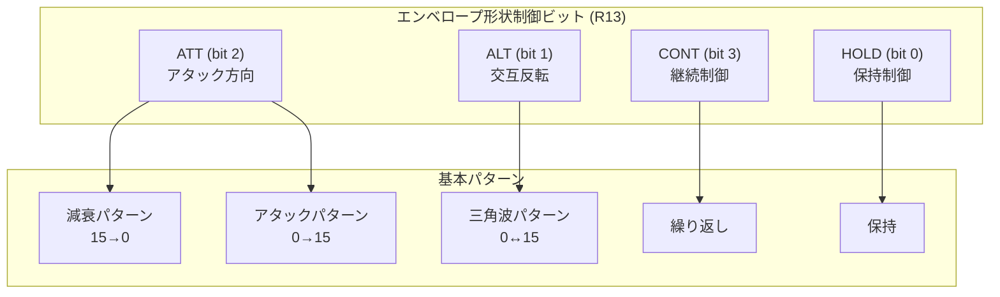

**R13制御ビットの機能:**

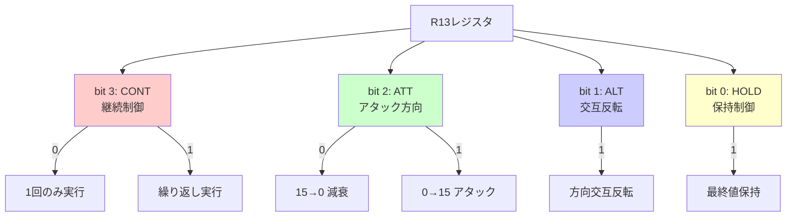

| R13 (10進) | R13 (2進) | 形状の名称 | 波形 |
|:-----------|:----------|:-----------|:-----|
| 0, 1, 2, 3 | `00xx` | \_________ (減衰→無音) | `15 -> 0` (1回) |
| 4, 5, 6, 7 | `01xx` | /\|_________ (アタック→無音) | `0 -> 15` (1回) |
| 8 | `1000` | \\\\\\\\\\\\ (減衰・繰返し) | `15 -> 0` (繰返し) |
| 9 | `1001` | \_________ (減衰→最大音量維持) | `15 -> 0` (1回、その後15を維持) |
| 10 | `1010` | \/\/\/\/\/\/ (三角波・減衰開始) | `15 <-> 0` (繰返し、減衰から開始) |
| 11 | `1011` | \^^^^^^^^^ (減衰→最大音量維持) | `15 -> 0` (1回、その後15を維持) |
| 12 | `1100` | /|/|/|/|/|/| (アタック・繰返し) | `0 -> 15` (繰返し) |
| 13 | `1101` | /^^^^^^^^^ (アタック→最大音量維持) | `0 -> 15` (1回、その後15を維持) |
| 14 | `1110` | /\/\/\/\/\/ (三角波・アタック開始) | `0 <-> 15` (繰返し、アタックから開始) |
| 15 | `1111` | /_________ (アタック→無音維持) | `0 -> 15` (1回、その後0を維持) |

### 2.5. ミキサーとデジタル-アナログコンバータ (DAC)

#### 2.5.1. ミキサー制御仕様

レジスタR7がミキシングを制御する。ビット0-2はそれぞれチャンネルA、B、Cのトーンジェネレータのアクティブロー（0で有効）イネーブルである。ビット3-5はそれぞれチャンネルA、B、Cのノイズジェネレータのアクティブローイネーブルである。チャンネルの最終的な1ビット出力は、論理式 `NOT ( (tone_output OR tone_disable_bit) AND (noise_output OR noise_disable_bit) )` で決定される。

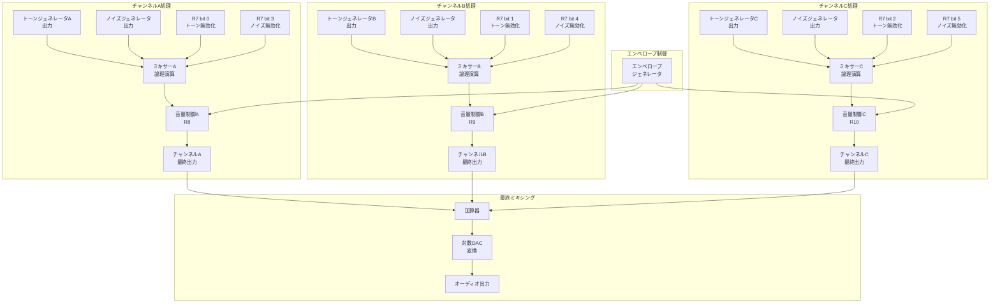

#### 2.5.2. 音量制御仕様

レジスタR8、R9、R10が各チャンネルの音量を制御する。ビット4（Mode）が0の場合、音量はビット3-0からの固定4ビット値となる。ビット4が1の場合、音量はグローバルな4ビットエンベロープジェネレータカウンタから取得される [2, 14]。

#### 2.5.3. DACモデリング仕様

4ビットの音量値は線形ではない。物理チップは、より広い知覚ダイナミックレンジを提供するために、対数的なデジタル-アナログコンバータを使用している [3, 7, 15, 16]。エミュレータは、本物のサウンドを再現するためにこの応答を模倣しなければならない。

**表 2.3: AY-3-8910 対数DAC出力レベル**

データシートには出力が「対数的」であると記載されているが [3]、具体的な値は提供されていない。YM2149のようなクローンチップは異なるカーブを持つため [17]、これは不正確さの主要な原因となり得る。MAMEプロジェクトは、正確なボリュームテーブルを作成するためにハードウェアレベルの測定を行っている [10]。単純な対数関数 `y = log(x)` では不正確であり、この仕様では特定のルックアップテーブルの使用を強制する必要がある。MAMEのテーブルをリファレンスとして採用することで、検証可能で忠実度の高い目標を提供し、元のドキュメントが残した曖昧さを解決する。このテーブルは、チップの内部4ビット音量レベルを、現代のオーディオドライバに適した16ビット線形PCM値にマッピングするための決定的な基準となる。

| 4ビット値 | 16ビットPCM出力 (例) |
| :--- | :--- |
| 0 | 0 |
| 1 | 837 |
| 2 | 1215 |
| 3 | 1764 |
| 4 | 2561 |
| 5 | 3718 |
| 6 | 5400 |
| 7 | 7839 |
| 8 | 11381 |
| 9 | 16523 |
| 10 | 23991 |
| 11 | 34830 |
| 12 | 45000 |
| 13 | 55000 |
| 14 | 60000 |
| 15 | 65535 |

*注: 上記の16ビット値は、MAMEなどのリファレンス実装で用いられる対数カーブを線形スケールにマッピングした一例である。実際の実装では、参照元から正確な値を導出し、スケーリングする必要がある。*

## 第3章: 音声出力ドライバ仕様

### 3.1. ドライバ統合

**要件:** エミュレータは、音声再生に `sounddevice` ライブラリを使用しなければならない。

**詳細:** `sounddevice` は、クロスプラットフォームのオーディオI/OライブラリであるPortAudioへのPythonバインディングを提供する。このライブラリは、音声データをNumPy配列として直接扱うことができるため、エミュレータコアで生成されたサンプルデータを効率的に再生するのに非常に適している。

### 3.2. 初期化と設定

**要件:** 音声出力は、`sounddevice.OutputStream` をコールバックモードで用いて初期化されなければならない。

**詳細:** リアルタイムの音声ストリーミングを実現するため、オーディオデバイスが新しいデータを要求するたびに呼び出されるコールバック関数を指定してストリームを開く。推奨される設定は以下の通りである。

*   `samplerate=44100`: オーディオのサンプリング周波数。
*   `channels=1`: 3つのPSGチャンネルは内部でモノラルにミックスされるため。
*   `dtype='float32'`: サンプルデータの形式。-1.0から1.0の範囲の浮動小数点数を使用する。
*   `blocksize`: コールバック関数に渡されるフレーム数。`0`（デフォルト）に設定すると、ホストの要件に基づいて最適なサイズが自動的に選択される。
*   `latency`: `low` に設定することで低遅延を試みることができるが、システムのパフォーマンスによっては音途切れが発生する可能性がある。

### 3.3. サンプル生成とバッファリング戦略

**要件:** オーディオドライバは、コールバック関数内でリアルタイムにサンプルを生成し、出力ストリームに供給しなければならない。

**詳細:** `sounddevice` のコールバックベースのアーキテクチャは、リアルタイムエミュレーションに最適である。このモデルでは、巨大なオーディオバッファを事前に生成してメモリに保持する必要がない。

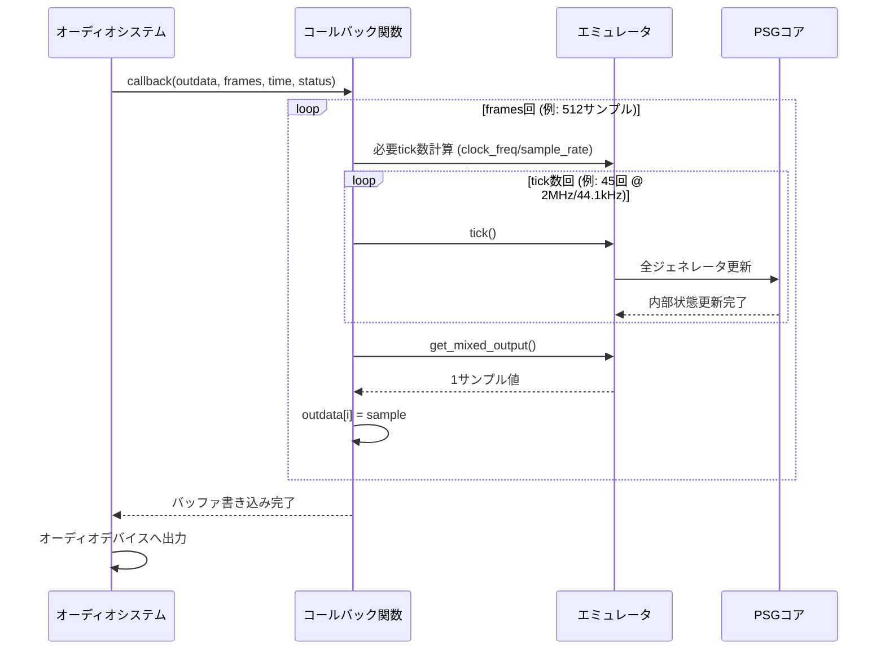

**実装パターン:**

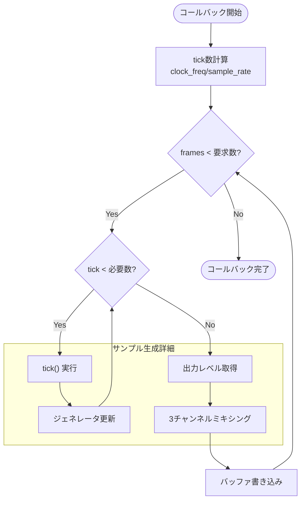

**実装手順:**

1.  **コールバック関数の定義:** `callback(outdata, frames, time, status)` というシグネチャを持つ関数を定義する。この関数は、オーディオバックエンドから別スレッドで定期的に呼び出される。
2.  **サンプル生成:** コールバック関数内で、`frames` 引数によって指定された数のオーディオサンプルを生成するループを実行する。
3.  **Tickの呼び出し:** 1オーディオサンプルを生成するために必要な回数だけ、エミュレータの `tick()` メソッドを呼び出す（例: エミュレートされたクロックが2MHz、サンプリングレートが44.1kHzの場合、オーディオサンプルあたり `2,000,000 / 44,100 ≈ 45` 回の `tick` が必要）。
4.  **ミキシングと出力:** 各 `tick` の後、`get_output_levels()` を呼び出して3チャンネルの出力を取得し、それらを合計して単一のサンプル値を計算する。
5.  **バッファへの書き込み:** `frames` 数分のサンプルをNumPy配列として生成した後、その配列を `outdata[:]` に代入することで、再生用のオーディオバッファにデータを書き込む。

このアプローチにより、エミュレータの状態遷移と音声サンプル生成が緊密に同期し、低遅延かつ安定した音声ストリーミングが実現される。

## 第4章: デバッガ機能とUI仕様

### 4.1. コアデバッグエンジン

#### 4.1.1. 実行制御

*   **ブレークポイント:** 特定のレジスタに書き込みが行われた際に実行を一時停止するブレークポイントを設定できる機能。
*   **ステップ実行:** `tick()` 単位でのステップ実行（「ステップイン」）、およびオーディオサンプル単位でのステップ実行（「ステップオーバー」）をサポートする。「ステップアウト」は現在のオーディオバッファが満たされるまで実行を継続する。

#### 4.1.2. 状態検査

全16レジスタをリアルタイムで表示するパネルを実装する。値は16進数、2進数、そしてデコードされた人間が読める形式（例: R7の場合、どのチャンネルのトーン／ノイズが有効かを表示）で表示されるべきである。

### 4.2. 高度な可視化ツール

#### 4.2.1. 出力波形表示

3つのチャンネルそれぞれの最終的なミックス・スケーリング済み出力を、短い時間窓（例: 1/50秒）にわたってプロットする、マルチトレースの「オシロスコープ」ビュー。

#### 4.2.2. エンベロープ輪郭表示

現在のエンベロープの定義された形状（表2.2より）と、4ビットエンベロープカウンタの現在位置／レベルを示すマーカーをグラフィカルにプロットする。これにより、エンベロープの挙動に関する即時の視覚的フィードバックが提供される。

### 4.3. 提案機能拡張

ユーザーが要求するデバッガ機能は、単純なレジスタダンプを超えている。真の価値を提供するためには、デバッガは元のハードウェアでは不可能な対話的な分析および操作ツールを提供すべきである。以下の機能は、現代のソフトウェアデバッガ [18] やオーディオ制作ツールから着想を得て、AY-3-8910の特定のアーキテクチャに合わせて調整されたものである。これらの機能は、デバッガを受動的なビューアから能動的なサウンドデザインツールへと変貌させる。

#### 4.3.1. 対話型ミキサーパネル

R7の6つのイネーブルビットに対応するチェックボックスを持つUI。これらのチェックボックスを切り替えることで、直接R7に書き込みが行われ、ユーザーは各チャンネルの個々のトーンおよびノイズソースをミュート／ソロにすることができ、複雑なサウンドの分解を可能にする。

#### 4.3.2. 状態スナップショットシステム

「状態保存」および「状態読込」ボタン。これらは、16バイトのレジスタ配列全体をファイル（例: JSON）にシリアライズする。これにより、ユーザーは特定のサウンド（「パッチ」）の設定をキャプチャし、後で呼び出すことができ、サウンドデザインやテストにおいて非常に価値がある。

#### 4.3.3. ライブレジスタ編集

レジスタビュー（4.1.2）は対話的であるべきである。ユーザーは任意のレジスタ値をクリックし、新しい16進値を入力すると、それが即座にエミュレータに書き込まれ、サウンドパラメータのリアルタイムな調整が可能になる。

#### 4.3.4. LFSR状態ビジュアライザ

ノイズジェネレータのLFSRの完全な17ビットの2進数値をリアルタイムで更新表示する。これは、ノイズアルゴリズムの正しい実装を検証し、その擬似ランダムパターンを理解するために不可欠である。