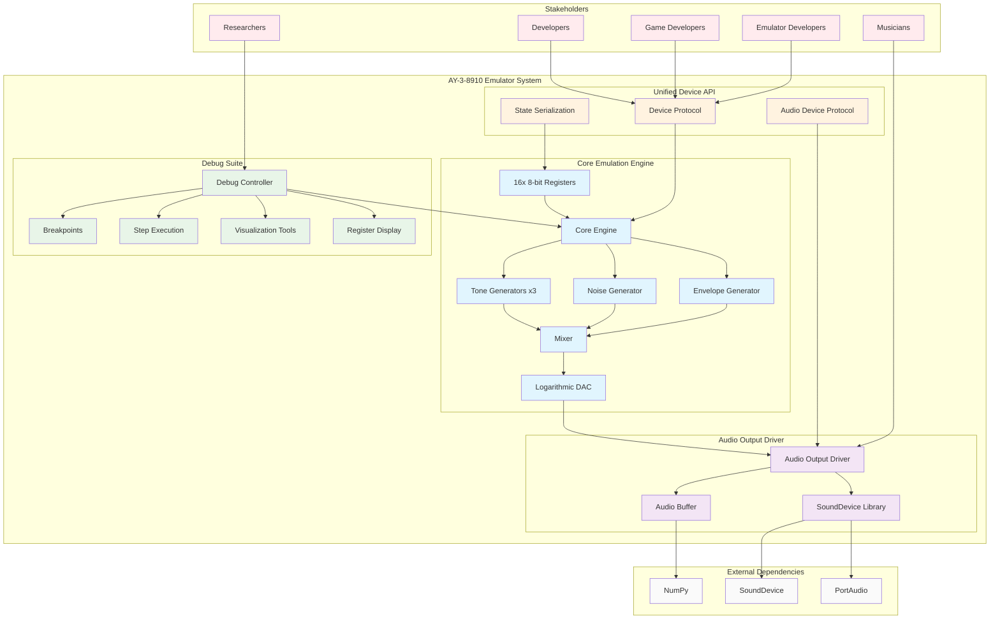
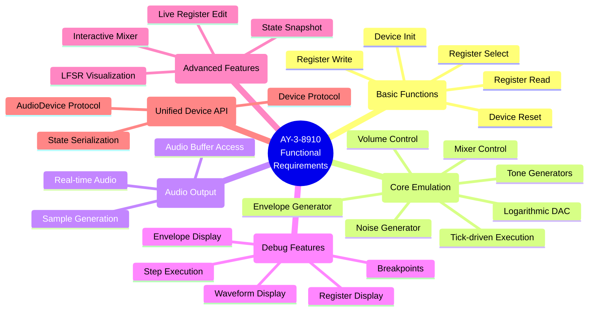
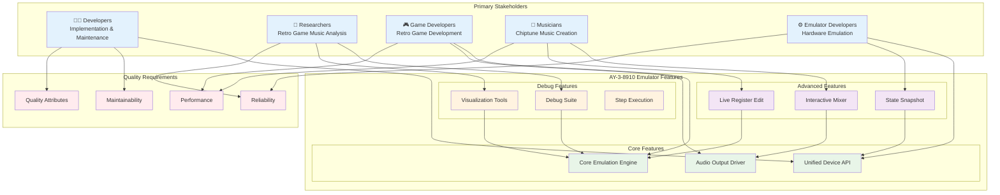
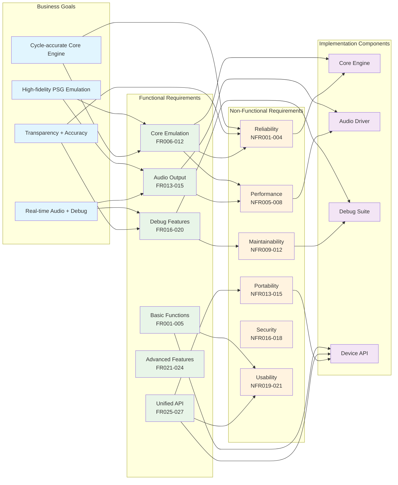
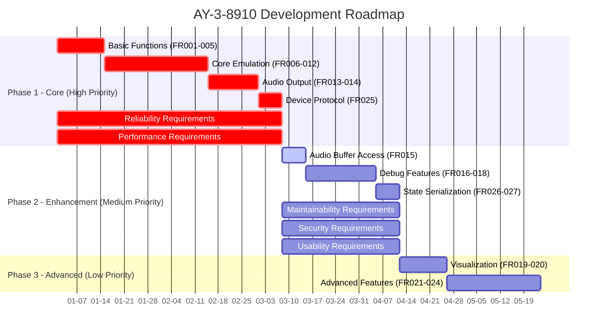

# AY-3-8910シミュレータ ソフトウェア要求仕様書

## (SW101) 制約条件リスト

### 1. 製品企画・製品開発戦略

**製品目標:**
- AY-3-8910 PSGチップの高忠実度ソフトウェアエミュレータの開発
- サイクル精度を重視したコアエミュレーションエンジンの実現
- リアルタイム音声出力とデバッグ機能を統合したリファレンス実装の提供
- 分析・開発目的での動作の透明性とサウンド再生の正確性の両立

**開発戦略:**
- Python言語による実装（クロスプラットフォーム対応）
- 統一デバイスAPI（`device_if_api_requirements.md`）への準拠
- モジュール化されたアーキテクチャによる保守性と拡張性の確保

### 2. 製品特性

**技術的特性:**
- Tick駆動実行モデルによるサイクル精度のエミュレーション
- 3つのトーンジェネレータ、1つのノイズジェネレータ、1つのエンベロープジェネレータの並列動作
- 17ビットLFSRによる擬似乱数ノイズ生成
- 対数DACによる音量制御
- 16個の8ビットレジスタによる状態管理

**機能特性:**
- リアルタイム音声出力（sounddeviceライブラリ使用）
- 統合デバッグスイート（ブレークポイント、ステップ実行、状態検査）
- 高度な可視化ツール（波形表示、エンベロープ輪郭表示）

### 3. 製品のステークホルダ

**主要ステークホルダ:**
- **開発者**: エミュレータの実装・保守・拡張を行う技術者
- **研究者**: レトロゲーム音楽の分析・研究を行う学術関係者
- **ゲーム開発者**: レトロゲームの開発・移植を行う開発者
- **音楽制作者**: チップチューン音楽の制作を行う音楽家
- **エミュレータ開発者**: 他のハードウェアエミュレータ開発者（API準拠による再利用）

### 4. 製品構成

**主要コンポーネント:**
- **コアエミュレーションエンジン**: AY-3-8910の内部ロジック実装
- **音声出力ドライバ**: sounddeviceライブラリによるリアルタイム音声再生
- **デバッグスイート**: 実行制御、状態検査、可視化ツール
- **統一デバイスAPI**: 他のエミュレータコンポーネントとの統合インターフェース

### 5. 再利用ソフトウェア

**外部ライブラリ:**
- **sounddevice**: クロスプラットフォーム音声I/O（PortAudioバインディング）
- **NumPy**: 数値計算とオーディオバッファ処理
- **Python標準ライブラリ**: typing、dataclasses、enum等

**参照実装:**
- **MAME**: ボリュームテーブルとLFSRアルゴリズムの参照
- **既存エミュレータ**: RealBoy等のTick駆動モデル実装パターン

### 6. 開発・テスト・導入環境

**開発環境:**
- **言語**: Python 3.8以上
- **OS**: Windows、macOS、Linux（クロスプラットフォーム対応）
- **IDE**: 任意（VS Code、PyCharm等）

**テスト環境:**
- **単体テスト**: pytestフレームワーク
- **統合テスト**: 音声出力の検証
- **パフォーマンステスト**: リアルタイム音声生成の性能測定

**導入環境:**
- **実行環境**: Python 3.8以上が動作する任意の環境
- **依存関係**: sounddevice、NumPy
- **配布形式**: Pythonパッケージ（pip install可能）

## (SW102) ソフトウェア機能要求リスト

### 基本機能要求

| 要求ID | 機能名 | 説明 | 優先度 |
|--------|--------|------|--------|
| FR001 | デバイス初期化 | マスタークロック周波数を指定してエミュレータを初期化 | 高 |
| FR002 | デバイスリセット | 全レジスタをゼロクリアして初期状態にリセット | 高 |
| FR003 | レジスタ選択 | 0-15の範囲でレジスタを選択 | 高 |
| FR004 | レジスタ書き込み | 選択されたレジスタに8ビット値を書き込み | 高 |
| FR005 | レジスタ読み込み | 選択されたレジスタから8ビット値を読み込み | 高 |

### コアエミュレーション機能要求

| 要求ID | 機能名 | 説明 | 優先度 |
|--------|--------|------|--------|
| FR006 | Tick駆動実行 | マスタークロックサイクル単位でエミュレーション進行 | 高 |
| FR007 | トーンジェネレータ | 3つの独立した12ビットトーンジェネレータ実装 | 高 |
| FR008 | ノイズジェネレータ | 17ビットLFSRによる擬似乱数ノイズ生成 | 高 |
| FR009 | エンベロープジェネレータ | 16ビット周期と4ビット音量カウンタによるエンベロープ生成 | 高 |
| FR010 | ミキサー制御 | R7レジスタによるトーン/ノイズのミキシング制御 | 高 |
| FR011 | 音量制御 | 固定音量とエンベロープモードの切り替え | 高 |
| FR012 | 対数DAC | MAME準拠の対数ボリュームテーブル実装 | 高 |

### 音声出力機能要求

| 要求ID | 機能名 | 説明 | 優先度 |
|--------|--------|------|--------|
| FR013 | リアルタイム音声出力 | sounddeviceによるコールバックベース音声再生 | 高 |
| FR014 | サンプル生成 | 44.1kHz、モノラル、float32形式でのサンプル生成 | 高 |
| FR015 | オーディオバッファ取得 | 生成されたオーディオバッファのNumPy配列取得 | 中 |

### デバッグ機能要求

| 要求ID | 機能名 | 説明 | 優先度 |
|--------|--------|------|--------|
| FR016 | ブレークポイント | 特定レジスタ書き込み時の実行停止 | 中 |
| FR017 | ステップ実行 | tick単位とサンプル単位でのステップ実行 | 中 |
| FR018 | レジスタ表示 | 16進数、2進数、デコード形式でのレジスタ表示 | 中 |
| FR019 | 波形表示 | 3チャンネルの出力波形オシロスコープ表示 | 低 |
| FR020 | エンベロープ表示 | エンベロープ形状と現在レベルのグラフィカル表示 | 低 |

### 高度機能要求

| 要求ID | 機能名 | 説明 | 優先度 |
|--------|--------|------|--------|
| FR021 | 対話型ミキサー | R7レジスタのリアルタイム編集によるミキシング制御 | 低 |
| FR022 | 状態スナップショット | レジスタ状態の保存・復元機能 | 低 |
| FR023 | ライブレジスタ編集 | レジスタ値のリアルタイム編集 | 低 |
| FR024 | LFSR可視化 | ノイズジェネレータの17ビットLFSR状態表示 | 低 |

### 統一デバイスAPI準拠要求

| 要求ID | 機能名 | 説明 | 優先度 |
|--------|--------|------|--------|
| FR025 | Deviceプロトコル実装 | 統一デバイスAPIのDeviceプロトコル準拠 | 高 |
| FR026 | 状態シリアライズ | get_state/set_stateメソッドによる状態保存・復元 | 中 |
| FR027 | AudioDeviceプロトコル | オーディオデバイス専用プロトコル実装 | 中 |

## (SW103) ソフトウェア非機能要求リスト

```mermaid
graph LR
    subgraph "Non-Functional Requirements"
        subgraph "Quality Attributes"
            REL[Reliability]
            PERF[Performance]
            MAINT[Maintainability]
            PORT[Portability]
            SEC[Security]
            USE[Usability]
        end
        
        subgraph "Reliability (NFR001-004)"
            DET[Determinism<br/>100% Reproducible]
            CYC[Cycle Accuracy<br/>±1 cycle]
            AUD[Audio Quality<br/>95% match]
            ERR[Error Handling<br/>0% crash rate]
        end
        
        subgraph "Performance (NFR005-008)"
            RT[Real-time<br/>≤50ms latency]
            CPU[CPU Usage<br/>≤50% single core]
            MEM[Memory<br/>≤100MB]
            BOOT[Boot Time<br/>≤1 second]
        end
        
        subgraph "Maintainability (NFR009-012)"
            MOD[Modularity<br/>No circular deps]
            TEST[Test Coverage<br/>≥90%]
            DOC[Documentation<br/>100% public APIs]
            QUAL[Code Quality<br/>0 warnings]
        end
        
        subgraph "Portability (NFR013-015)"
            CROSS[Cross-platform<br/>Win/Mac/Linux]
            PY[Python 3.8+<br/>3.8-3.12]
            DEPS[Dependencies<br/>≤3 libraries]
        end
        
        subgraph "Security (NFR016-018)"
            VALID[Input Validation<br/>0-255 range]
            SAFE[Memory Safety<br/>No buffer overflow]
            PRIV[Privilege Separation<br/>No system rights]
        end
        
        subgraph "Usability (NFR019-021)"
            API_CONS[API Consistency<br/>100% compliance]
            MSG[Error Messages<br/>EN/JP support]
            CONFIG[Easy Config<br/>Default values]
        end
    end
    
    REL --> DET
    REL --> CYC
    REL --> AUD
    REL --> ERR
    
    PERF --> RT
    PERF --> CPU
    PERF --> MEM
    PERF --> BOOT
    
    MAINT --> MOD
    MAINT --> TEST
    MAINT --> DOC
    MAINT --> QUAL
    
    PORT --> CROSS
    PORT --> PY
    PORT --> DEPS
    
    SEC --> VALID
    SEC --> SAFE
    SEC --> PRIV
    
    USE --> API_CONS
    USE --> MSG
    USE --> CONFIG
    
    classDef reliability fill:#ffcdd2
    classDef performance fill:#c8e6c9
    classDef maintainability fill:#bbdefb
    classDef portability fill:#f8bbd9
    classDef security fill:#ffecb3
    classDef usability fill:#d1c4e9
    
    class REL,DET,CYC,AUD,ERR reliability
    class PERF,RT,CPU,MEM,BOOT performance
    class MAINT,MOD,TEST,DOC,QUAL maintainability
    class PORT,CROSS,PY,DEPS portability
    class SEC,VALID,SAFE,PRIV security
    class USE,API_CONS,MSG,CONFIG usability
```

### 信頼性要求

| 要求ID | 要求名 | 説明 | 測定基準 |
|--------|--------|------|----------|
| NFR001 | 決定性 | 同じ初期状態と入力に対して完全に再現可能な結果 | 100%再現性 |
| NFR002 | サイクル精度 | マスタークロックサイクル単位での正確なタイミング | ±1サイクル以内 |
| NFR003 | 音声品質 | 実ハードウェアとの音響的差異 | 主観的評価で95%以上一致 |
| NFR004 | エラー処理 | 不正な入力値に対する適切なエラーハンドリング | クラッシュ率0% |

### 性能要求

| 要求ID | 要求名 | 説明 | 測定基準 |
|--------|--------|------|----------|
| NFR005 | リアルタイム性能 | 音声出力の遅延なし再生 | 遅延50ms以内 |
| NFR006 | CPU使用率 | エミュレーション実行時のCPU負荷 | 単一コアで50%以内 |
| NFR007 | メモリ使用量 | 実行時のメモリ消費量 | 100MB以内 |
| NFR008 | 起動時間 | エミュレータの初期化完了時間 | 1秒以内 |

### 保守性要求

| 要求ID | 要求名 | 説明 | 測定基準 |
|--------|--------|------|----------|
| NFR009 | モジュール性 | コンポーネント間の疎結合設計 | 循環依存なし |
| NFR010 | テストカバレッジ | 単体テストのコードカバレッジ | 90%以上 |
| NFR011 | ドキュメント | API仕様と実装詳細の文書化 | 全公開メソッド100% |
| NFR012 | コード品質 | 静的解析ツールによる品質チェック | 警告0件 |

### 移植性要求

| 要求ID | 要求名 | 説明 | 測定基準 |
|--------|--------|------|----------|
| NFR013 | クロスプラットフォーム | Windows、macOS、Linuxでの動作 | 全OSで同一動作 |
| NFR014 | Python互換性 | Python 3.8以上のバージョン対応 | 3.8-3.12で動作 |
| NFR015 | 依存関係最小化 | 外部ライブラリの最小限使用 | 必須ライブラリ3個以内 |

### セキュリティ要求

| 要求ID | 要求名 | 説明 | 測定基準 |
|--------|--------|------|----------|
| NFR016 | 入力検証 | レジスタ値の範囲チェック | 0-255の範囲外で例外 |
| NFR017 | メモリ安全 | バッファオーバーフローの防止 | 静的解析で検出なし |
| NFR018 | 権限分離 | 最小権限の原則に基づく設計 | システム権限不要 |

### 使いやすさ要求

| 要求ID | 要求名 | 説明 | 測定基準 |
|--------|--------|------|----------|
| NFR019 | API一貫性 | 統一デバイスAPIとの完全準拠 | 100%準拠 |
| NFR020 | エラーメッセージ | 分かりやすいエラーメッセージ | 英語・日本語対応 |
| NFR021 | 設定の簡易性 | 最小限の設定で動作開始 | デフォルト値で動作 |

## (SW104) 優先順位付けされたソフトウェア要求リスト

### 優先度：高（必須実装）

**基本機能（FR001-FR005）**
- デバイス初期化・リセット
- レジスタ選択・読み書き

**コアエミュレーション（FR006-FR012）**
- Tick駆動実行
- トーン・ノイズ・エンベロープジェネレータ
- ミキサー・音量制御・対数DAC

**音声出力（FR013-FR014）**
- リアルタイム音声出力
- サンプル生成

**API準拠（FR025）**
- Deviceプロトコル実装

**信頼性（NFR001-NFR004）**
- 決定性・サイクル精度・音声品質・エラー処理

**性能（NFR005-NFR007）**
- リアルタイム性能・CPU使用率・メモリ使用量

**移植性（NFR013-NFR015）**
- クロスプラットフォーム・Python互換性・依存関係最小化

### 優先度：中（重要実装）

**音声出力（FR015）**
- オーディオバッファ取得

**デバッグ機能（FR016-FR018）**
- ブレークポイント・ステップ実行・レジスタ表示

**API準拠（FR026-FR027）**
- 状態シリアライズ・AudioDeviceプロトコル

**性能（NFR008）**
- 起動時間

**保守性（NFR009-NFR012）**
- モジュール性・テストカバレッジ・ドキュメント・コード品質

**セキュリティ（NFR016-NFR018）**
- 入力検証・メモリ安全・権限分離

**使いやすさ（NFR019-NFR021）**
- API一貫性・エラーメッセージ・設定の簡易性

### 優先度：低（将来実装）

**デバッグ機能（FR019-FR020）**
- 波形表示・エンベロープ表示

**高度機能（FR021-FR024）**
- 対話型ミキサー・状態スナップショット・ライブレジスタ編集・LFSR可視化

この優先順位付けにより、まずはコアエミュレーション機能と基本音声出力を実装し、その後デバッグ機能と高度機能を段階的に追加していく開発戦略が明確になります。