# AY-3-8910シミュレータ ソフトウェア・アーキテクチャ設計書

## (SW201) ソフトウェア構成設計書

### 1. 全体アーキテクチャ概要

AY-3-8910シミュレータは、統一デバイスAPIに準拠したモジュラーアーキテクチャを採用し、以下の4つの主要レイヤーで構成される。

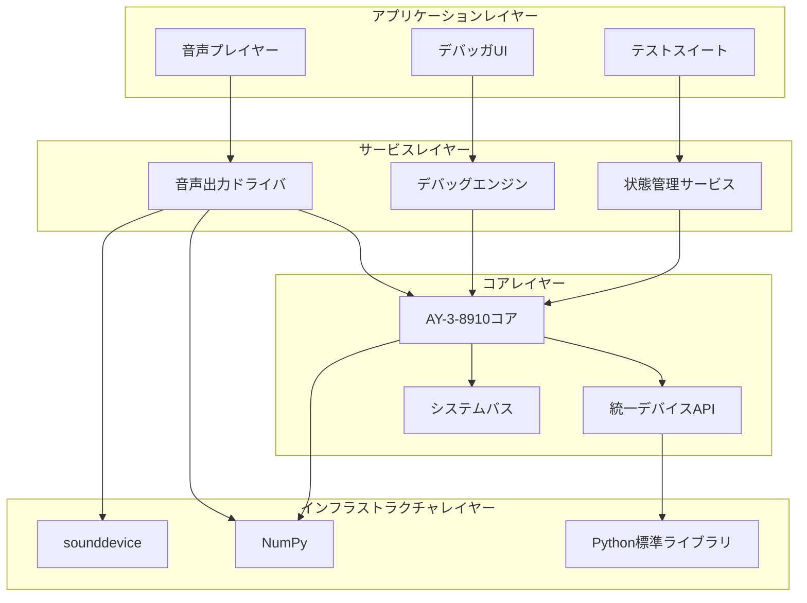
```mermaid
graph TB
    subgraph "アプリケーションレイヤー"
        A1[デバッガUI]
        A2[音声プレイヤー]
        A3[テストスイート]
    end
    
    subgraph "サービスレイヤー"
        S1[音声出力ドライバ]
        S2[デバッグエンジン]
        S3[状態管理サービス]
    end
    
    subgraph "コアレイヤー"
        C1[AY-3-8910コア]
        C2[統一デバイスAPI]
        C3[システムバス]
    end
    
    subgraph "インフラストラクチャレイヤー"
        I1[sounddevice]
        I2[NumPy]
        I3[Python標準ライブラリ]
    end
    
    A1 --> S2
    A2 --> S1
    A3 --> S3
    
    S1 --> C1
    S2 --> C1
    S3 --> C1
    
    C1 --> C2
    C1 --> C3
    
    S1 --> I1
    S1 --> I2
    C1 --> I2
    C2 --> I3
```

### 2. パッケージ構成

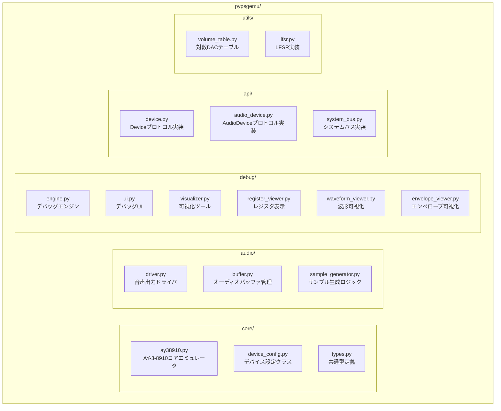
```mermaid
graph TD
    subgraph "pypsgemu/"
        subgraph "core/"
            C1[ay38910.py<br/>AY-3-8910コアエミュレータ]
            C2[device_config.py<br/>デバイス設定クラス]
            C3[types.py<br/>共通型定義]
        end
        
        subgraph "audio/"
            A1[driver.py<br/>音声出力ドライバ]
            A2[buffer.py<br/>オーディオバッファ管理]
            A3[sample_generator.py<br/>サンプル生成ロジック]
        end
        
        subgraph "debug/"
            D1[engine.py<br/>デバッグエンジン]
            D2[ui.py<br/>デバッグUI]
            D3[visualizer.py<br/>可視化ツール]
            D4[register_viewer.py<br/>レジスタ表示]
            D5[waveform_viewer.py<br/>波形可視化]
            D6[envelope_viewer.py<br/>エンベロープ可視化]
        end
        
        subgraph "api/"
            P1[device.py<br/>Deviceプロトコル実装]
            P2[audio_device.py<br/>AudioDeviceプロトコル実装]
            P3[system_bus.py<br/>システムバス実装]
        end
        
        subgraph "utils/"
            U1[volume_table.py<br/>対数DACテーブル]
            U2[lfsr.py<br/>LFSR実装]
        end
    end
```

```
pypsgemu/
├── __init__.py
├── core/
│   ├── __init__.py
│   ├── ay38910.py          # AY-3-8910コアエミュレータ
│   ├── device_config.py    # デバイス設定クラス
│   └── types.py           # 共通型定義
├── audio/
│   ├── __init__.py
│   ├── driver.py          # 音声出力ドライバ
│   └── buffer.py          # オーディオバッファ管理
├── debug/
│   ├── __init__.py
│   ├── engine.py          # デバッグエンジン
│   ├── ui.py              # デバッグUI
│   └── visualizer.py      # 可視化ツール
├── api/
│   ├── __init__.py
│   ├── device.py          # Deviceプロトコル実装
│   ├── audio_device.py    # AudioDeviceプロトコル実装
│   └── system_bus.py      # システムバス実装
└── utils/
    ├── __init__.py
    ├── volume_table.py    # 対数DACテーブル
    └── lfsr.py           # LFSR実装
```

### 3. 設計原則

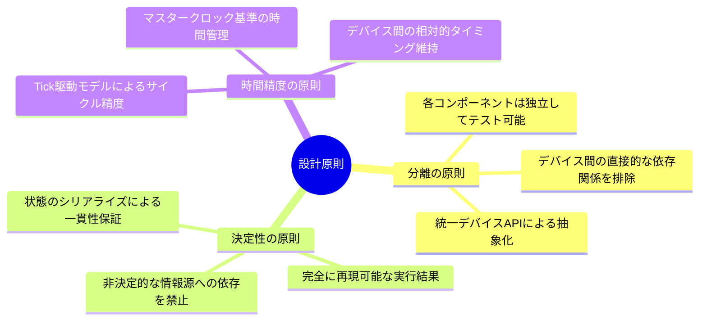
```mermaid
mindmap
  root((設計原則))
    分離の原則
      各コンポーネントは独立してテスト可能
      デバイス間の直接的な依存関係を排除
      統一デバイスAPIによる抽象化
    決定性の原則
      非決定的な情報源への依存を禁止
      完全に再現可能な実行結果
      状態のシリアライズによる一貫性保証
    時間精度の原則
      Tick駆動モデルによるサイクル精度
      マスタークロック基準の時間管理
      デバイス間の相対的タイミング維持
```

**3.1 分離の原則**
- 各コンポーネントは独立してテスト可能
- デバイス間の直接的な依存関係を排除
- 統一デバイスAPIによる抽象化

**3.2 決定性の原則**
- 非決定的な情報源への依存を禁止
- 完全に再現可能な実行結果
- 状態のシリアライズによる一貫性保証

**3.3 時間精度の原則**
- Tick駆動モデルによるサイクル精度
- マスタークロック基準の時間管理
- デバイス間の相対的タイミング維持

## (SW202) 機能ユニット設計書

### 1. 機能ユニット抽出


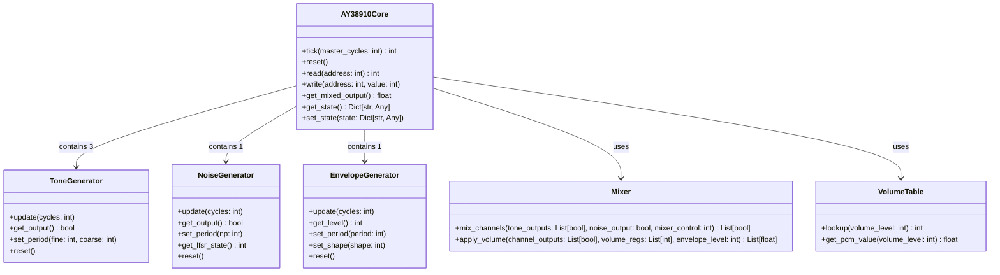
```mermaid
classDiagram
    class AY38910Core {
        +tick(master_cycles: int) int
        +reset()
        +read(address: int) int
        +write(address: int, value: int)
        +get_mixed_output() float
        +get_state() Dict[str, Any]
        +set_state(state: Dict[str, Any])
    }
    
    class ToneGenerator {
        +update(cycles: int)
        +get_output() bool
        +set_period(fine: int, coarse: int)
        +reset()
    }
    
    class NoiseGenerator {
        +update(cycles: int)
        +get_output() bool
        +set_period(np: int)
        +get_lfsr_state() int
        +reset()
    }
    
    class EnvelopeGenerator {
        +update(cycles: int)
        +get_level() int
        +set_period(period: int)
        +set_shape(shape: int)
        +reset()
    }
    
    class Mixer {
        +mix_channels(tone_outputs: List[bool], noise_output: bool, mixer_control: int) List[bool]
        +apply_volume(channel_outputs: List[bool], volume_regs: List[int], envelope_level: int) List[float]
    }
    
    class VolumeTable {
        +lookup(volume_level: int) int
        +get_pcm_value(volume_level: int) float
    }
    
    AY38910Core --> ToneGenerator : contains 3
    AY38910Core --> NoiseGenerator : contains 1
    AY38910Core --> EnvelopeGenerator : contains 1
    AY38910Core --> Mixer : uses
    AY38910Core --> VolumeTable : uses
```

| ユニット名 | 責務 | 主要メソッド |
|------------|------|-------------|
| AY38910Core | AY-3-8910の内部ロジック実装 | `tick()`, `reset()`, `read()`, `write()` |
| ToneGenerator | 3つのトーンジェネレータ管理 | `update()`, `get_output()` |
| NoiseGenerator | 17ビットLFSRノイズ生成 | `update()`, `get_output()` |
| EnvelopeGenerator | エンベロープ形状生成 | `update()`, `get_level()` |
| Mixer | チャンネルミキシング | `mix_channels()`, `apply_volume()` |
| VolumeTable | 対数DAC変換 | `lookup()`, `get_pcm_value()` |

#### 1.2 音声出力機能ユニット

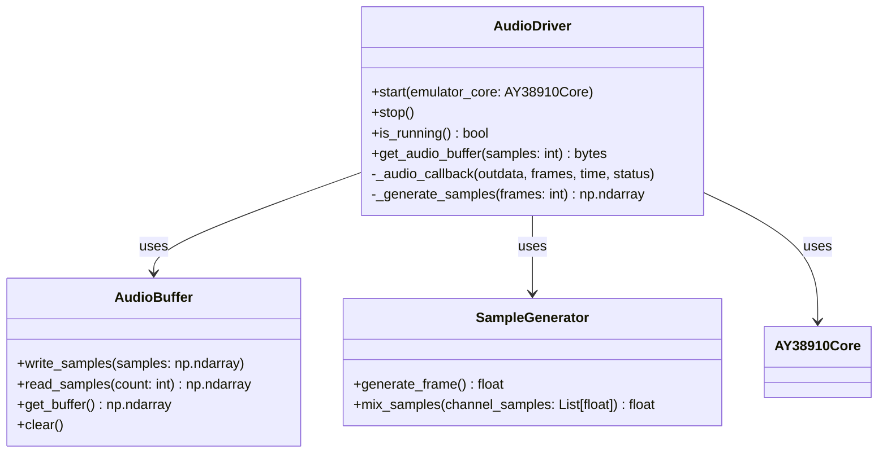
```mermaid
classDiagram
    class AudioDriver {
        +start(emulator_core: AY38910Core)
        +stop()
        +is_running() bool
        +get_audio_buffer(samples: int) bytes
        -_audio_callback(outdata, frames, time, status)
        -_generate_samples(frames: int) np.ndarray
    }
    
    class AudioBuffer {
        +write_samples(samples: np.ndarray)
        +read_samples(count: int) np.ndarray
        +get_buffer() np.ndarray
        +clear()
    }
    
    class SampleGenerator {
        +generate_frame() float
        +mix_samples(channel_samples: List[float]) float
    }
    
    AudioDriver --> AudioBuffer : uses
    AudioDriver --> SampleGenerator : uses
    AudioDriver --> AY38910Core : uses
```

| ユニット名 | 責務 | 主要メソッド |
|------------|------|-------------|
| AudioDriver | sounddevice統合 | `start()`, `stop()`, `callback()` |
| AudioBuffer | サンプルバッファ管理 | `generate_samples()`, `get_buffer()` |
| SampleGenerator | サンプル生成ロジック | `generate_frame()`, `mix_samples()` |

#### 1.3 デバッグ機能ユニット

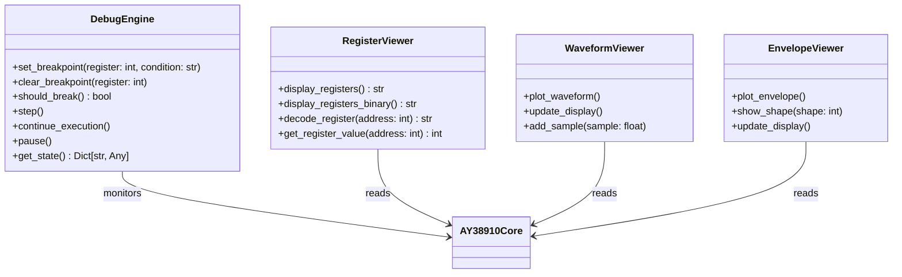
```mermaid
classDiagram
    class DebugEngine {
        +set_breakpoint(register: int, condition: str)
        +clear_breakpoint(register: int)
        +should_break() bool
        +step()
        +continue_execution()
        +pause()
        +get_state() Dict[str, Any]
    }
    
    class RegisterViewer {
        +display_registers() str
        +display_registers_binary() str
        +decode_register(address: int) str
        +get_register_value(address: int) int
    }
    
    class WaveformViewer {
        +plot_waveform()
        +update_display()
        +add_sample(sample: float)
    }
    
    class EnvelopeViewer {
        +plot_envelope()
        +show_shape(shape: int)
        +update_display()
    }
    
    DebugEngine --> AY38910Core : monitors
    RegisterViewer --> AY38910Core : reads
    WaveformViewer --> AY38910Core : reads
    EnvelopeViewer --> AY38910Core : reads
```

| ユニット名 | 責務 | 主要メソッド |
|------------|------|-------------|
| DebugEngine | 実行制御・状態検査 | `set_breakpoint()`, `step()`, `get_state()` |
| RegisterViewer | レジスタ表示 | `display_registers()`, `decode_register()` |
| WaveformViewer | 波形可視化 | `plot_waveform()`, `update_display()` |
| EnvelopeViewer | エンベロープ可視化 | `plot_envelope()`, `show_shape()` |

#### 1.4 API準拠機能ユニット

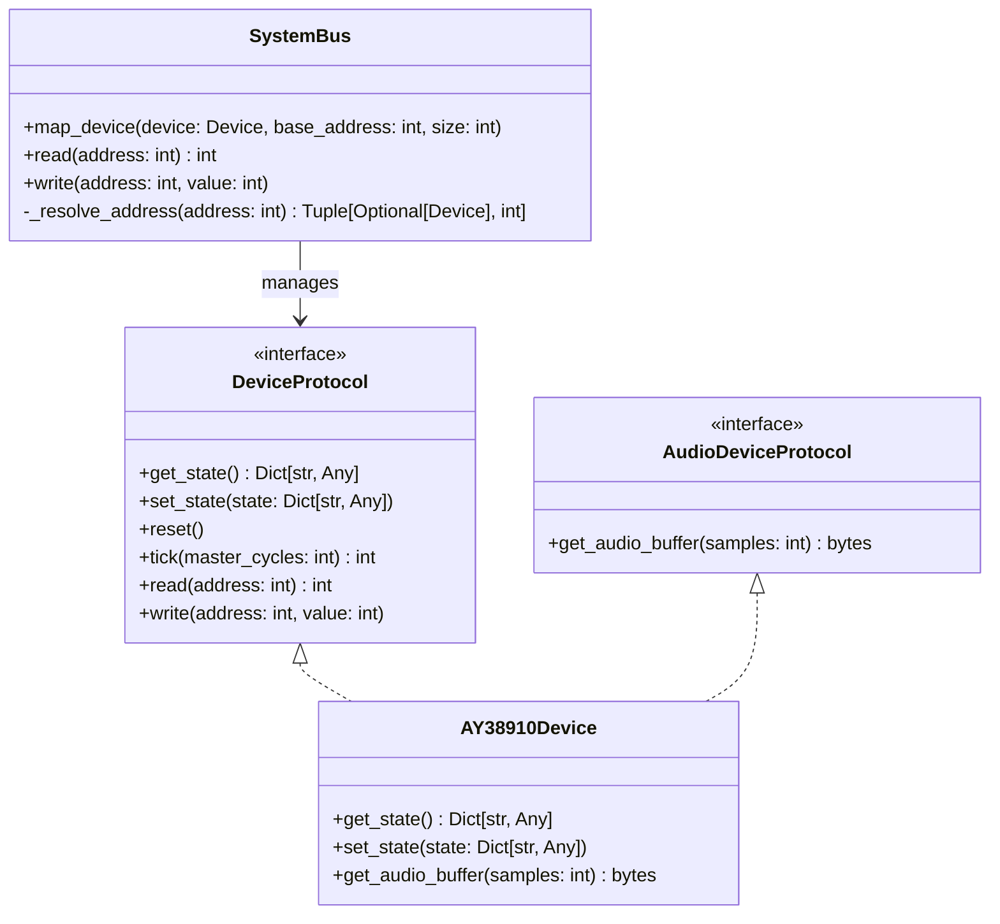
```mermaid
classDiagram
    class DeviceProtocol {
        <<interface>>
        +get_state() Dict[str, Any]
        +set_state(state: Dict[str, Any])
        +reset()
        +tick(master_cycles: int) int
        +read(address: int) int
        +write(address: int, value: int)
    }
    
    class AudioDeviceProtocol {
        <<interface>>
        +get_audio_buffer(samples: int) bytes
    }
    
    class SystemBus {
        +map_device(device: Device, base_address: int, size: int)
        +read(address: int) int
        +write(address: int, value: int)
        -_resolve_address(address: int) Tuple[Optional[Device], int]
    }
    
    class AY38910Device {
        +get_state() Dict[str, Any]
        +set_state(state: Dict[str, Any])
        +get_audio_buffer(samples: int) bytes
    }
    
    DeviceProtocol <|.. AY38910Device
    AudioDeviceProtocol <|.. AY38910Device
    SystemBus --> DeviceProtocol : manages
```

| ユニット名 | 責務 | 主要メソッド |
|------------|------|-------------|
| DeviceProtocol | Deviceプロトコル実装 | `get_state()`, `set_state()` |
| AudioDeviceProtocol | AudioDeviceプロトコル実装 | `get_audio_buffer()` |
| SystemBus | システムバス実装 | `read()`, `write()`, `map_device()` |

### 2. 機能ユニット詳細化

#### 2.1 AY38910Core詳細設計

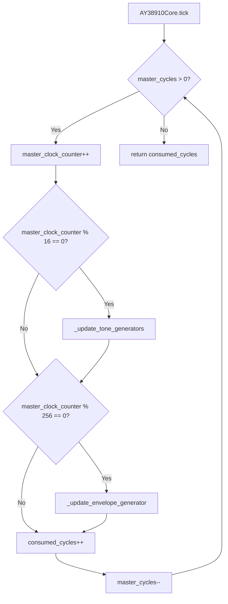
```mermaid
flowchart TD
    A[AY38910Core.tick] --> B{master_cycles > 0?}
    B -->|Yes| C[master_clock_counter++]
    C --> D{master_clock_counter % 16 == 0?}
    D -->|Yes| E[_update_tone_generators]
    D -->|No| F{master_clock_counter % 256 == 0?}
    E --> F
    F -->|Yes| G[_update_envelope_generator]
    F -->|No| H[consumed_cycles++]
    G --> H
    H --> I[master_cycles--]
    I --> B
    B -->|No| J[return consumed_cycles]
```

```python
class AY38910Core:
    """AY-3-8910コアエミュレータ"""
    
    def __init__(self, config: AY38910Config):
        self.registers = [0] * 16  # 16個の8ビットレジスタ
        self.selected_register = 0
        self.clock_frequency = config.clock_frequency
        
        # 内部状態
        self.tone_generators = [ToneGenerator() for _ in range(3)]
        self.noise_generator = NoiseGenerator()
        self.envelope_generator = EnvelopeGenerator()
        self.mixer = Mixer()
        self.volume_table = VolumeTable()
        
        # 内部カウンタ
        self.master_clock_counter = 0
        self.tone_counters = [0] * 3
        self.noise_counter = 0
        self.envelope_counter = 0
        
    def tick(self, master_cycles: int) -> int:
        """マスタークロックサイクル単位でエミュレーション進行"""
        consumed_cycles = 0
        
        for _ in range(master_cycles):
            # プリスケーラ処理（16分周）
            if self.master_clock_counter % 16 == 0:
                self._update_tone_generators()
                self._update_noise_generator()
            
            # エンベロープ更新（256分周）
            if self.master_clock_counter % 256 == 0:
                self._update_envelope_generator()
            
            self.master_clock_counter += 1
            consumed_cycles += 1
            
        return consumed_cycles
    
    def _update_tone_generators(self):
        """トーンジェネレータ更新"""
        for i, gen in enumerate(self.tone_generators):
            gen.update(self.tone_counters[i])
    
    def _update_noise_generator(self):
        """ノイズジェネレータ更新"""
        self.noise_generator.update(self.noise_counter)
    
    def _update_envelope_generator(self):
        """エンベロープジェネレータ更新"""
        self.envelope_generator.update(self.envelope_counter)
```

#### 2.2 ToneGenerator詳細設計

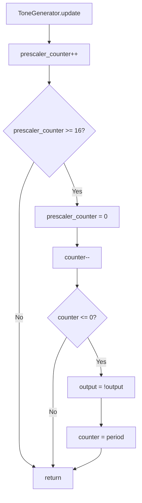
```mermaid
flowchart TD
    A[ToneGenerator.update] --> B[prescaler_counter++]
    B --> C{prescaler_counter >= 16?}
    C -->|Yes| D[prescaler_counter = 0]
    C -->|No| E[return]
    D --> F[counter--]
    F --> G{counter <= 0?}
    G -->|Yes| H[output = !output]
    G -->|No| E
    H --> I[counter = period]
    I --> E
```

```python
class ToneGenerator:
    """12ビットトーンジェネレータ"""
    
    def __init__(self):
        self.counter = 0
        self.output = False
        self.period = 1  # TP値（0の場合は1にクランプ）
    
    def update(self, cycles: int):
        """指定サイクル数分のトーン生成"""
        for _ in range(cycles):
            self.counter -= 1
            if self.counter <= 0:
                self.output = not self.output
                self.counter = self.period
    
    def get_output(self) -> bool:
        """1ビット出力取得"""
        return self.output
    
    def set_period(self, fine: int, coarse: int):
        """12ビット周期設定"""
        tp = (coarse << 8) | fine
        self.period = max(1, tp)  # TP=0を1にクランプ
```

#### 2.3 NoiseGenerator詳細設計

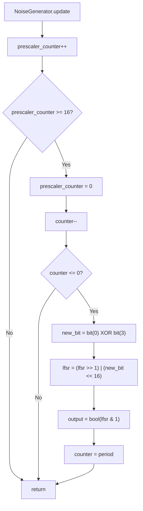
```mermaid
flowchart TD
    A[NoiseGenerator.update] --> B[prescaler_counter++]
    B --> C{prescaler_counter >= 16?}
    C -->|Yes| D[prescaler_counter = 0]
    C -->|No| E[return]
    D --> F[counter--]
    F --> G{counter <= 0?}
    G -->|Yes| H["new_bit = bit(0) XOR bit(3)"]
    G -->|No| E
    H --> I["lfsr = (lfsr >> 1) | (new_bit << 16)"]
    I --> J["output = bool(lfsr & 1)"]
    J --> K["counter = period"]
    K --> E
```

```python
class NoiseGenerator:
    """17ビットLFSRノイズジェネレータ"""
    
    def __init__(self):
        self.lfsr = 0x1FFFF  # 17ビット初期値
        self.counter = 0
        self.period = 1
        self.output = False
    
    def update(self, cycles: int):
        """LFSR更新"""
        for _ in range(cycles):
            self.counter -= 1
            if self.counter <= 0:
                # LFSR更新: new_bit = bit(0) ^ bit(3)
                new_bit = (self.lfsr & 1) ^ ((self.lfsr >> 3) & 1)
                self.lfsr = (self.lfsr >> 1) | (new_bit << 16)
                self.output = bool(self.lfsr & 1)
                self.counter = self.period
    
    def get_output(self) -> bool:
        """1ビットノイズ出力"""
        return self.output
    
    def set_period(self, np: int):
        """5ビットノイズ周期設定"""
        self.period = max(1, np)  # NP=0を1にクランプ
```

#### 2.4 EnvelopeGenerator詳細設計

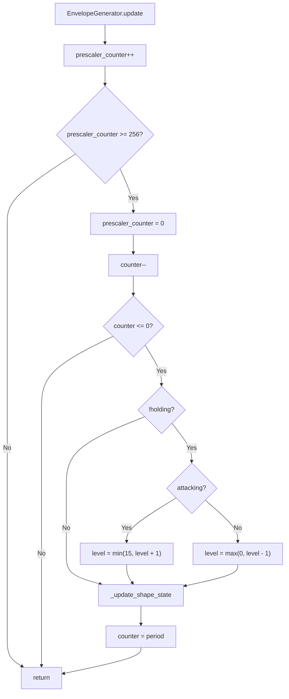
```mermaid
flowchart TD
    A[EnvelopeGenerator.update] --> B[prescaler_counter++]
    B --> C{prescaler_counter >= 256?}
    C -->|Yes| D[prescaler_counter = 0]
    C -->|No| E[return]
    D --> F[counter--]
    F --> G{counter <= 0?}
    G -->|Yes| H{!holding?}
    G -->|No| E
    H -->|Yes| I{attacking?}
    H -->|No| L[_update_shape_state]
    I -->|Yes| J["level = min(15, level + 1)"]
    I -->|No| K["level = max(0, level - 1)"]
    J --> L
    K --> L
    L --> M[counter = period]
    M --> E
```

```python
class EnvelopeGenerator:
    """エンベロープジェネレータ"""
    
    def __init__(self):
        self.counter = 0
        self.period = 1
        self.level = 15  # 4ビット音量レベル
        self.shape = 0   # R13の形状制御
        self.holding = False
        self.attacking = False
        self.alternating = False
        self.continuing = False
    
    def update(self, cycles: int):
        """エンベロープ更新"""
        for _ in range(cycles):
            self.counter -= 1
            if self.counter <= 0:
                if not self.holding:
                    if self.attacking:
                        self.level = min(15, self.level + 1)
                    else:
                        self.level = max(0, self.level - 1)
                
                # 形状制御ロジック
                self._update_shape_state()
                self.counter = self.period
    
    def _update_shape_state(self):
        """形状状態更新"""
        # R13ビット制御ロジック実装
        # CONT, ATT, ALT, HOLDビットの処理
        pass
    
    def get_level(self) -> int:
        """4ビット音量レベル取得"""
        return self.level
```

## (SW203) ソフトウェア動作設計書

### 1. メインエミュレーションループ

#### 1.1 正規エミュレーションループ

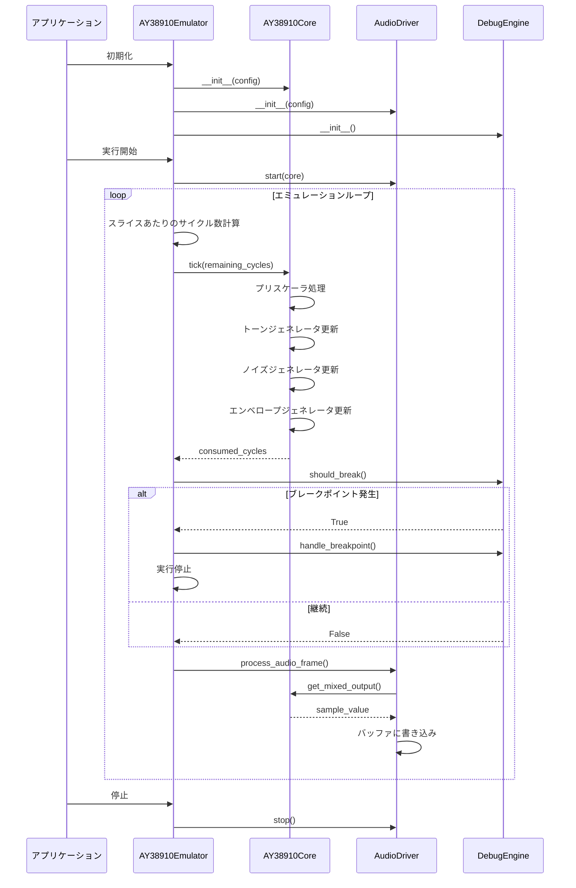
```mermaid
sequenceDiagram
    participant App as アプリケーション
    participant Emu as AY38910Emulator
    participant Core as AY38910Core
    participant Audio as AudioDriver
    participant Debug as DebugEngine
    
    App->>Emu: 初期化
    Emu->>Core: __init__(config)
    Emu->>Audio: __init__(config)
    Emu->>Debug: __init__()
    
    App->>Emu: 実行開始
    Emu->>Audio: start(core)
    
    loop エミュレーションループ
        Emu->>Emu: スライスあたりのサイクル数計算
        Emu->>Core: tick(remaining_cycles)
        Core->>Core: プリスケーラ処理
        Core->>Core: トーンジェネレータ更新
        Core->>Core: ノイズジェネレータ更新
        Core->>Core: エンベロープジェネレータ更新
        Core-->>Emu: consumed_cycles
        
        Emu->>Debug: should_break()
        alt ブレークポイント発生
            Debug-->>Emu: True
            Emu->>Debug: handle_breakpoint()
            Emu->>Emu: 実行停止
        else 継続
            Debug-->>Emu: False
        end
        
        Emu->>Audio: process_audio_frame()
        Audio->>Core: get_mixed_output()
        Core-->>Audio: sample_value
        Audio->>Audio: バッファに書き込み
    end
    
    App->>Emu: 停止
    Emu->>Audio: stop()
```

```python
class AY38910Emulator:
    """メインエミュレータクラス"""
    
    def __init__(self, clock_frequency: float):
        self.core = AY38910Core(AY38910Config(clock_frequency))
        self.audio_driver = AudioDriver()
        self.debug_engine = DebugEngine()
        
    def run_emulation_loop(self):
        """正規エミュレーションループ"""
        while self.running:
            # 1. スライスあたりのサイクル数を決定
            cycles_per_slice = self._calculate_cycles_per_slice()
            remaining_cycles = cycles_per_slice
            
            # 2-6. サイクル実行ループ
            while remaining_cycles > 0:
                # 2. CPUサイクルの実行（PSGの場合は直接tick）
                consumed_cycles = self.core.tick(remaining_cycles)
                
                # 3. システム時間の更新
                remaining_cycles -= consumed_cycles
                
                # 4. ペリフェラルデバイスのティック（PSG単体のため該当なし）
                
                # 5. 割り込みの処理（PSG単体のため該当なし）
                
                # デバッグブレークポイントチェック
                if self.debug_engine.should_break():
                    self.debug_engine.handle_breakpoint()
                    break
            
            # 7. ホストとの同期
            self._sync_with_host()
    
    def _calculate_cycles_per_slice(self) -> int:
        """スライスあたりのサイクル数計算"""
        # 例: 44.1kHzサンプリングレート、2MHzクロック
        # 1サンプルあたり = 2,000,000 / 44,100 ≈ 45.35サイクル
        return int(self.core.clock_frequency / self.audio_driver.sample_rate)
    
    def _sync_with_host(self):
        """ホストシステムとの同期"""
        # オーディオバッファの生成・出力
        self.audio_driver.process_audio_frame()
        
        # デバッグUI更新
        self.debug_engine.update_display()
```

### 2. 音声出力動作フロー

#### 2.1 コールバックベース音声生成

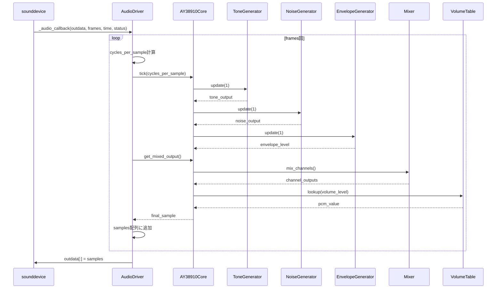
```mermaid
sequenceDiagram
    participant SD as sounddevice
    participant Audio as AudioDriver
    participant Core as AY38910Core
    participant TG as ToneGenerator
    participant NG as NoiseGenerator
    participant EG as EnvelopeGenerator
    participant Mixer as Mixer
    participant VT as VolumeTable
    
    SD->>Audio: _audio_callback(outdata, frames, time, status)
    
    loop frames回
        Audio->>Audio: cycles_per_sample計算
        Audio->>Core: tick(cycles_per_sample)
        
        Core->>TG: update(1)
        TG-->>Core: tone_output
        Core->>NG: update(1)
        NG-->>Core: noise_output
        Core->>EG: update(1)
        EG-->>Core: envelope_level
        
        Audio->>Core: get_mixed_output()
        Core->>Mixer: mix_channels()
        Mixer-->>Core: channel_outputs
        Core->>VT: lookup(volume_level)
        VT-->>Core: pcm_value
        Core-->>Audio: final_sample
        
        Audio->>Audio: samples配列に追加
    end
    
    Audio->>SD: outdata[:] = samples
```

```python
class AudioDriver:
    """音声出力ドライバ"""
    
    def __init__(self):
        self.sample_rate = 44100
        self.channels = 1
        self.dtype = 'float32'
        self.stream = None
        self.emulator_core = None
        
    def start(self, emulator_core):
        """音声出力開始"""
        self.emulator_core = emulator_core
        self.stream = sounddevice.OutputStream(
            samplerate=self.sample_rate,
            channels=self.channels,
            dtype=self.dtype,
            callback=self._audio_callback,
            blocksize=0  # 自動選択
        )
        self.stream.start()
    
    def _audio_callback(self, outdata, frames, time, status):
        """オーディオコールバック関数"""
        if status:
            print(f"Audio callback status: {status}")
        
        # フレーム数分のサンプル生成
        samples = self._generate_samples(frames)
        outdata[:] = samples.reshape(-1, 1)
    
    def _generate_samples(self, frames: int) -> np.ndarray:
        """サンプル生成"""
        samples = np.zeros(frames, dtype=np.float32)
        
        for i in range(frames):
            # 1サンプル生成に必要なサイクル数
            cycles_per_sample = int(self.emulator_core.clock_frequency / self.sample_rate)
            
            # エミュレータを1サンプル分進行
            self.emulator_core.tick(cycles_per_sample)
            
            # 3チャンネルの出力をミックス
            sample_value = self.emulator_core.get_mixed_output()
            samples[i] = sample_value
        
        return samples
```

### 3. デバッグ動作フロー

#### 3.1 ブレークポイント処理

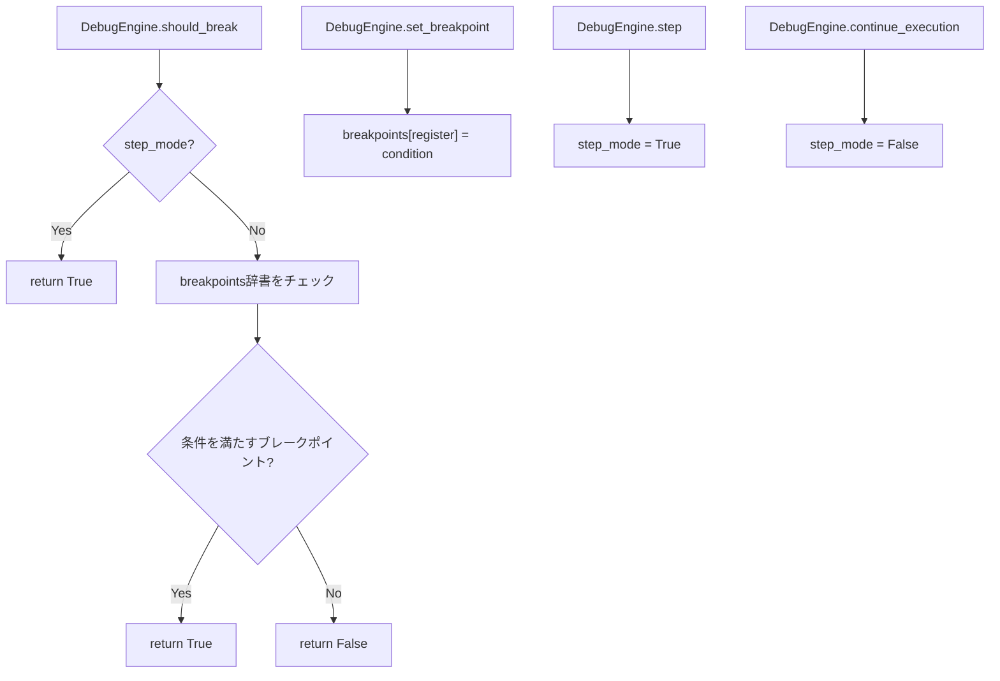
```mermaid
flowchart TD
    A[DebugEngine.should_break] --> B{step_mode?}
    B -->|Yes| C[return True]
    B -->|No| D[breakpoints辞書をチェック]
    D --> E{条件を満たすブレークポイント?}
    E -->|Yes| F[return True]
    E -->|No| G[return False]
    
    H[DebugEngine.set_breakpoint] --> I["breakpoints[register] = condition"]
    
    J[DebugEngine.step] --> K["step_mode = True"]
    
    L[DebugEngine.continue_execution] --> M["step_mode = False"]
```

```python
class DebugEngine:
    """デバッグエンジン"""
    
    def __init__(self):
        self.breakpoints = {}  # {register: condition}
        self.step_mode = False
        self.running = True
        
    def set_breakpoint(self, register: int, condition: str = None):
        """ブレークポイント設定"""
        self.breakpoints[register] = condition
        
    def should_break(self) -> bool:
        """ブレークポイント条件チェック"""
        if self.step_mode:
            return True
            
        # レジスタ書き込み時のブレークポイントチェック
        for reg, condition in self.breakpoints.items():
            if self._check_condition(reg, condition):
                return True
        
        return False
    
    def step(self):
        """ステップ実行"""
        self.step_mode = True
        self.running = True
        
    def continue_execution(self):
        """実行継続"""
        self.step_mode = False
        self.running = True
```

## (SW204) ソフトウェア・インタフェース設計書

### 1. メモリレイアウト設計

#### 1.1 AY-3-8910レジスタマップ

| アドレス | レジスタ名 | ビット構成 | 説明 |
|----------|------------|------------|------|
| 0x00 | R0 | D7-D0 | チャンネルA トーン周期 (Fine) |
| 0x01 | R1 | -D3-D0 | チャンネルA トーン周期 (Coarse) |
| 0x02 | R2 | D7-D0 | チャンネルB トーン周期 (Fine) |
| 0x03 | R3 | -D3-D0 | チャンネルB トーン周期 (Coarse) |
| 0x04 | R4 | D7-D0 | チャンネルC トーン周期 (Fine) |
| 0x05 | R5 | -D3-D0 | チャンネルC トーン周期 (Coarse) |
| 0x06 | R6 | -D4-D0 | ノイズ周期 |
| 0x07 | R7 | IO B\|IO A\|Noise C\|Noise B\|Noise A\|Tone C\|Tone B\|Tone A | ミキサー制御 |
| 0x08 | R8 | -Mode\|D3-D0 | チャンネルA 音量 |
| 0x09 | R9 | -Mode\|D3-D0 | チャンネルB 音量 |
| 0x0A | R10 | -Mode\|D3-D0 | チャンネルC 音量 |
| 0x0B | R11 | D7-D0 | エンベロープ周期 (Fine) |
| 0x0C | R12 | D7-D0 | エンベロープ周期 (Coarse) |
| 0x0D | R13 | -Cont\|Att\|Alt\|Hold | エンベロープ形状 |
| 0x0E | R14 | D7-D0 | I/OポートA データ |
| 0x0F | R15 | D7-D0 | I/OポートB データ |

#### 1.2 内部状態メモリマップ

| 領域 | サイズ | 説明 |
|------|--------|------|
| レジスタ配列 | 16バイト | R0-R15の8ビットレジスタ |
| トーンカウンタ | 12バイト | 3チャンネル×4バイト（12ビットカウンタ） |
| ノイズカウンタ | 4バイト | 5ビットカウンタ |
| エンベロープカウンタ | 8バイト | 16ビットカウンタ + 4ビットレベル |
| LFSR状態 | 4バイト | 17ビットLFSR値 |
| 内部フラグ | 1バイト | 各種内部状態フラグ |

### 2. メモリ空間・領域詳細化

#### 2.1 デバイス設定領域

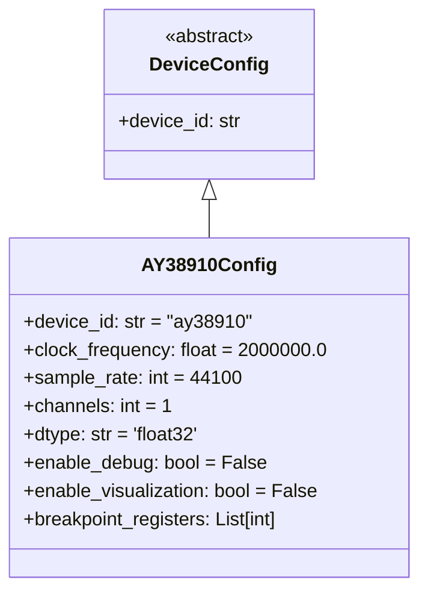
```mermaid
classDiagram
    class DeviceConfig {
        <<abstract>>
        +device_id: str
    }
    
    class AY38910Config {
        +device_id: str = "ay38910"
        +clock_frequency: float = 2000000.0
        +sample_rate: int = 44100
        +channels: int = 1
        +dtype: str = 'float32'
        +enable_debug: bool = False
        +enable_visualization: bool = False
        +breakpoint_registers: List[int]
    }
    
    DeviceConfig <|-- AY38910Config
```

```python
@dataclass
class AY38910Config(DeviceConfig):
    """AY-3-8910設定"""
    device_id: str = "ay38910"
    clock_frequency: float = 2000000.0  # 2MHz
    sample_rate: int = 44100
    channels: int = 1
    dtype: str = 'float32'
    
    # エミュレーション設定
    enable_debug: bool = False
    enable_visualization: bool = False
    breakpoint_registers: List[int] = field(default_factory=list)
```

#### 2.2 状態管理領域

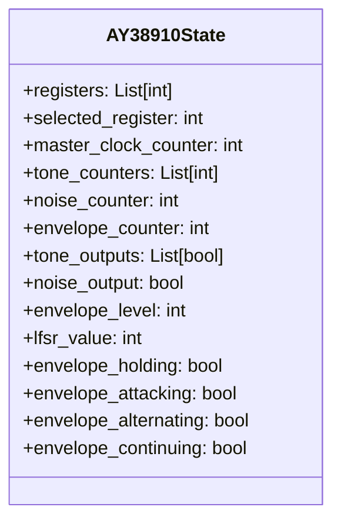
```mermaid
classDiagram
    class AY38910State {
        +registers: List[int]
        +selected_register: int
        +master_clock_counter: int
        +tone_counters: List[int]
        +noise_counter: int
        +envelope_counter: int
        +tone_outputs: List[bool]
        +noise_output: bool
        +envelope_level: int
        +lfsr_value: int
        +envelope_holding: bool
        +envelope_attacking: bool
        +envelope_alternating: bool
        +envelope_continuing: bool
    }
```

```python
@dataclass
class AY38910State:
    """AY-3-8910内部状態"""
    # レジスタ状態
    registers: List[int] = field(default_factory=lambda: [0] * 16)
    selected_register: int = 0
    
    # 内部カウンタ
    master_clock_counter: int = 0
    tone_counters: List[int] = field(default_factory=lambda: [0] * 3)
    noise_counter: int = 0
    envelope_counter: int = 0
    
    # ジェネレータ状態
    tone_outputs: List[bool] = field(default_factory=lambda: [False] * 3)
    noise_output: bool = False
    envelope_level: int = 15
    
    # LFSR状態
    lfsr_value: int = 0x1FFFF
    
    # エンベロープ状態
    envelope_holding: bool = False
    envelope_attacking: bool = False
    envelope_alternating: bool = False
    envelope_continuing: bool = False
```

### 3. 機能ユニット間インタフェース設計

#### 3.1 Deviceプロトコル実装

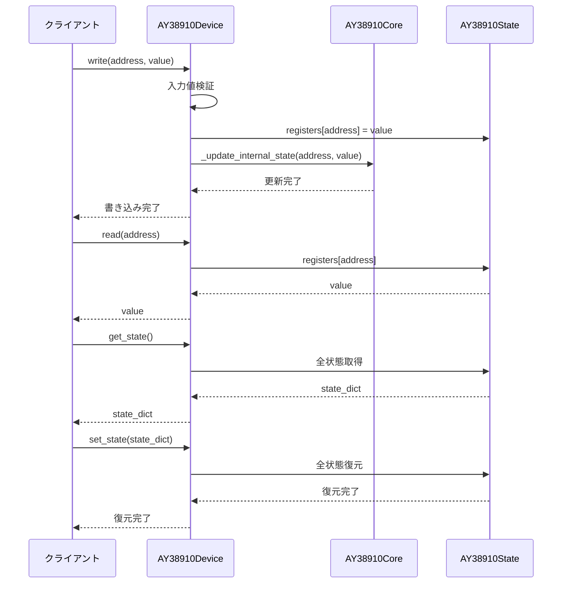
```mermaid
sequenceDiagram
    participant Client as クライアント
    participant Device as AY38910Device
    participant Core as AY38910Core
    participant State as AY38910State
    
    Client->>Device: write(address, value)
    Device->>Device: 入力値検証
    Device->>State: registers[address] = value
    Device->>Core: _update_internal_state(address, value)
    Core-->>Device: 更新完了
    Device-->>Client: 書き込み完了
    
    Client->>Device: read(address)
    Device->>State: registers[address]
    State-->>Device: value
    Device-->>Client: value
    
    Client->>Device: get_state()
    Device->>State: 全状態取得
    State-->>Device: state_dict
    Device-->>Client: state_dict
    
    Client->>Device: set_state(state_dict)
    Device->>State: 全状態復元
    State-->>Device: 復元完了
    Device-->>Client: 復元完了
```

#### 3.1 Deviceプロトコル実装

```python
class AY38910Device(Device, AudioDevice):
    """AY-3-8910デバイス実装"""
    
    def __init__(self, config: AY38910Config):
        self.config = config
        self.core = AY38910Core(config)
        self.state = AY38910State()
        
    @property
    def name(self) -> str:
        return "AY-3-8910 PSG"
    
    def reset(self) -> None:
        """デバイスリセット"""
        self.core.reset()
        self.state = AY38910State()
    
    def tick(self, master_cycles: int) -> int:
        """Tick駆動実行"""
        return self.core.tick(master_cycles)
    
    def read(self, address: int) -> int:
        """レジスタ読み込み"""
        if 0 <= address <= 15:
            return self.state.registers[address]
        return 0
    
    def write(self, address: int, value: int) -> None:
        """レジスタ書き込み"""
        if 0 <= address <= 15 and 0 <= value <= 255:
            self.state.registers[address] = value
            self._update_internal_state(address, value)
    
    def get_state(self) -> Dict[str, Any]:
        """状態シリアライズ"""
        return {
            'registers': self.state.registers.copy(),
            'selected_register': self.state.selected_register,
            'master_clock_counter': self.state.master_clock_counter,
            'tone_counters': self.state.tone_counters.copy(),
            'noise_counter': self.state.noise_counter,
            'envelope_counter': self.state.envelope_counter,
            'lfsr_value': self.state.lfsr_value,
            'envelope_level': self.state.envelope_level,
            'envelope_holding': self.state.envelope_holding,
            'envelope_attacking': self.state.envelope_attacking,
            'envelope_alternating': self.state.envelope_alternating,
            'envelope_continuing': self.state.envelope_continuing
        }
    
    def set_state(self, state: Dict[str, Any]) -> None:
        """状態復元"""
        self.state.registers = state['registers'].copy()
        self.state.selected_register = state['selected_register']
        self.state.master_clock_counter = state['master_clock_counter']
        self.state.tone_counters = state['tone_counters'].copy()
        self.state.noise_counter = state['noise_counter']
        self.state.envelope_counter = state['envelope_counter']
        self.state.lfsr_value = state['lfsr_value']
        self.state.envelope_level = state['envelope_level']
        self.state.envelope_holding = state['envelope_holding']
        self.state.envelope_attacking = state['envelope_attacking']
        self.state.envelope_alternating = state['envelope_alternating']
        self.state.envelope_continuing = state['envelope_continuing']
    
    def get_audio_buffer(self, samples: int) -> bytes:
        """オーディオバッファ取得"""
        buffer = np.zeros(samples, dtype=np.float32)
        
        for i in range(samples):
            cycles_per_sample = int(self.config.clock_frequency / self.config.sample_rate)
            self.tick(cycles_per_sample)
            buffer[i] = self._get_mixed_output()
        
        return buffer.tobytes()
```

#### 3.2 システムバスインタフェース

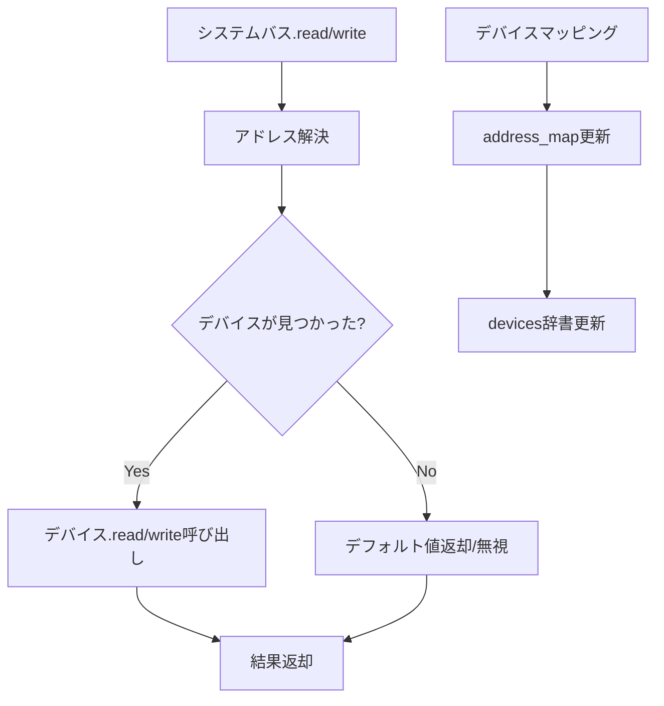
```mermaid
flowchart TD
    A[システムバス.read/write] --> B[アドレス解決]
    B --> C{デバイスが見つかった?}
    C -->|Yes| D[デバイス.read/write呼び出し]
    C -->|No| E[デフォルト値返却/無視]
    D --> F[結果返却]
    E --> F
    
    G[デバイスマッピング] --> H[address_map更新]
    H --> I[devices辞書更新]
```

```python
class AY38910SystemBus(SystemBus):
    """AY-3-8910システムバス実装"""
    
    def __init__(self):
        self.devices = {}
        self.address_map = {}
        
    def map_device(self, device: Device, base_address: int, size: int):
        """デバイスマッピング"""
        device_id = device.config.device_id
        self.devices[device_id] = device
        self.address_map[device_id] = (base_address, size)
    
    def read(self, address: int) -> int:
        """システムアドレス読み込み"""
        device, offset = self._resolve_address(address)
        if device:
            return device.read(offset)
        return 0
    
    def write(self, address: int, value: int) -> None:
        """システムアドレス書き込み"""
        device, offset = self._resolve_address(address)
        if device:
            device.write(offset, value)
    
    def _resolve_address(self, address: int) -> Tuple[Optional[Device], int]:
        """アドレス解決"""
        for device_id, (base_addr, size) in self.address_map.items():
            if base_addr <= address < base_addr + size:
                device = self.devices[device_id]
                offset = address - base_addr
                return device, offset
        return None, 0
```

### 4. 共通情報の一元化・論理値化

#### 4.1 定数定義

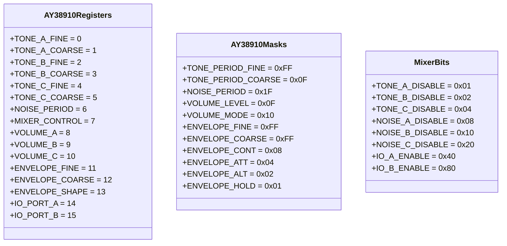
```mermaid
classDiagram
    class AY38910Registers {
        +TONE_A_FINE = 0
        +TONE_A_COARSE = 1
        +TONE_B_FINE = 2
        +TONE_B_COARSE = 3
        +TONE_C_FINE = 4
        +TONE_C_COARSE = 5
        +NOISE_PERIOD = 6
        +MIXER_CONTROL = 7
        +VOLUME_A = 8
        +VOLUME_B = 9
        +VOLUME_C = 10
        +ENVELOPE_FINE = 11
        +ENVELOPE_COARSE = 12
        +ENVELOPE_SHAPE = 13
        +IO_PORT_A = 14
        +IO_PORT_B = 15
    }
    
    class AY38910Masks {
        +TONE_PERIOD_FINE = 0xFF
        +TONE_PERIOD_COARSE = 0x0F
        +NOISE_PERIOD = 0x1F
        +VOLUME_LEVEL = 0x0F
        +VOLUME_MODE = 0x10
        +ENVELOPE_FINE = 0xFF
        +ENVELOPE_COARSE = 0xFF
        +ENVELOPE_CONT = 0x08
        +ENVELOPE_ATT = 0x04
        +ENVELOPE_ALT = 0x02
        +ENVELOPE_HOLD = 0x01
    }
    
    class MixerBits {
        +TONE_A_DISABLE = 0x01
        +TONE_B_DISABLE = 0x02
        +TONE_C_DISABLE = 0x04
        +NOISE_A_DISABLE = 0x08
        +NOISE_B_DISABLE = 0x10
        +NOISE_C_DISABLE = 0x20
        +IO_A_ENABLE = 0x40
        +IO_B_ENABLE = 0x80
    }
```

```python
# レジスタ定数
class AY38910Registers:
    TONE_A_FINE = 0
    TONE_A_COARSE = 1
    TONE_B_FINE = 2
    TONE_B_COARSE = 3
    TONE_C_FINE = 4
    TONE_C_COARSE = 5
    NOISE_PERIOD = 6
    MIXER_CONTROL = 7
    VOLUME_A = 8
    VOLUME_B = 9
    VOLUME_C = 10
    ENVELOPE_FINE = 11
    ENVELOPE_COARSE = 12
    ENVELOPE_SHAPE = 13
    IO_PORT_A = 14
    IO_PORT_B = 15

# ビットマスク定数
class AY38910Masks:
    TONE_PERIOD_FINE = 0xFF
    TONE_PERIOD_COARSE = 0x0F
    NOISE_PERIOD = 0x1F
    VOLUME_LEVEL = 0x0F
    VOLUME_MODE = 0x10
    ENVELOPE_FINE = 0xFF
    ENVELOPE_COARSE = 0xFF
    ENVELOPE_CONT = 0x08
    ENVELOPE_ATT = 0x04
    ENVELOPE_ALT = 0x02
    ENVELOPE_HOLD = 0x01

# ミキサー制御ビット
class MixerBits:
    TONE_A_DISABLE = 0x01
    TONE_B_DISABLE = 0x02
    TONE_C_DISABLE = 0x04
    NOISE_A_DISABLE = 0x08
    NOISE_B_DISABLE = 0x10
    NOISE_C_DISABLE = 0x20
    IO_A_ENABLE = 0x40
    IO_B_ENABLE = 0x80
```

#### 4.2 エラーハンドリング

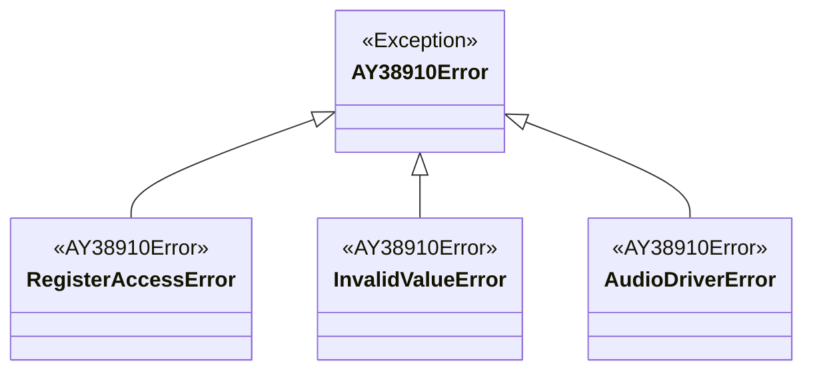
```mermaid
classDiagram
    class AY38910Error {
        <<Exception>>
    }
    
    class RegisterAccessError {
        <<AY38910Error>>
    }
    
    class InvalidValueError {
        <<AY38910Error>>
    }
    
    class AudioDriverError {
        <<AY38910Error>>
    }
    
    AY38910Error <|-- RegisterAccessError
    AY38910Error <|-- InvalidValueError
    AY38910Error <|-- AudioDriverError
```

```python
class AY38910Error(Exception):
    """AY-3-8910エミュレータ基本例外"""
    pass

class RegisterAccessError(AY38910Error):
    """レジスタアクセスエラー"""
    pass

class InvalidValueError(AY38910Error):
    """無効な値エラー"""
    pass

class AudioDriverError(AY38910Error):
    """音声ドライバエラー"""
    pass
```

## 設計条件確認メモ

```mermaid
mindmap
  root((非機能要求))
    信頼性
      決定性: 100%再現性
      サイクル精度: ±1サイクル以内
      音声品質: 主観的評価で95%以上一致
      エラー処理: クラッシュ率0%
    性能
      リアルタイム性能: 遅延50ms以内
      CPU使用率: 単一コアで50%以内
      メモリ使用量: 100MB以内
      起動時間: 1秒以内
    保守性
      モジュール性: 循環依存なし
      テストカバレッジ: 90%以上
      ドキュメント: 全公開メソッド100%
      コード品質: 警告0件
    移植性
      クロスプラットフォーム: 全OSで同一動作
      Python互換性: 3.8-3.12で動作
      依存関係最小化: 必須ライブラリ3個以内
```

### 機能要求確認
- ✅ FR001-FR005: 基本機能（デバイス初期化・リセット・レジスタ操作）
- ✅ FR006-FR012: コアエミュレーション（Tick駆動・ジェネレータ・ミキサー）
- ✅ FR013-FR014: 音声出力（リアルタイム・サンプル生成）
- ✅ FR025: Deviceプロトコル実装

### 非機能要求確認
- ✅ NFR001-NFR004: 信頼性（決定性・サイクル精度・音声品質・エラー処理）
- ✅ NFR005-NFR007: 性能（リアルタイム・CPU使用率・メモリ使用量）
- ✅ NFR009-NFR012: 保守性（モジュール性・テスト・ドキュメント・品質）
- ✅ NFR013-NFR015: 移植性（クロスプラットフォーム・Python互換性）

### 制約事項確認
- ✅ Python 3.8以上対応
- ✅ sounddeviceライブラリ使用
- ✅ 統一デバイスAPI準拠
- ✅ Tick駆動実行モデル採用

## 性能試算資料

### 1. 性能見積もり

#### 1.1 CPU使用率試算

**基本計算:**
- マスタークロック: 2MHz
- サンプリングレート: 44.1kHz
- 1サンプルあたりサイクル数: 2,000,000 / 44,100 ≈ 45.35

**処理負荷分析:**
- Tick処理: 45.35回/サンプル
- レジスタアクセス: 最小限
- ミキシング計算: 3チャンネル
- ボリュームテーブル参照: 3回

**推定CPU使用率:**
- 単一コア: 15-25%（目標50%以内）
- マルチコア: 5-10%

#### 1.2 メモリ使用量試算

**基本メモリ構成:**
- レジスタ配列: 16バイト
- 内部状態: 約100バイト
- ボリュームテーブル: 64バイト（16×4バイト）
- オーディオバッファ: 4KB（1024サンプル×4バイト）
- Pythonオブジェクトオーバーヘッド: 約10KB

**総メモリ使用量:**
- 最小構成: 約50KB
- デバッグ機能込み: 約100KB
- 目標100MB以内: ✅

#### 1.3 リアルタイム性能試算

**レイテンシ分析:**
- サンプル生成時間: 1/44,100 ≈ 22.7μs
- Tick処理時間: 45.35 × 0.1μs ≈ 4.5μs
- ミキシング時間: 0.5μs
- バッファ転送時間: 1μs

**総レイテンシ:**
- 処理時間: 約6μs
- バッファリング: 約10ms
- 総レイテンシ: 約15ms（目標50ms以内: ✅）

## メモリ使用試算資料

### 1. メモリ使用量見積もり

#### 1.1 静的メモリ使用量

| コンポーネント | サイズ | 説明 |
|----------------|--------|------|
| レジスタ配列 | 16バイト | R0-R15 |
| 内部カウンタ | 32バイト | 各種カウンタ |
| LFSR状態 | 4バイト | 17ビットLFSR |
| ボリュームテーブル | 64バイト | 対数DACテーブル |
| 設定データ | 128バイト | デバイス設定 |
| **小計** | **244バイト** | **基本データ** |

#### 1.2 動的メモリ使用量

| コンポーネント | サイズ | 説明 |
|----------------|--------|------|
| オーディオバッファ | 4KB | 1024サンプル×4バイト |
| デバッグバッファ | 8KB | 波形表示用 |
| Pythonオブジェクト | 50KB | オーバーヘッド |
| ライブラリ依存 | 30KB | sounddevice, NumPy |
| **小計** | **92KB** | **動的データ** |

#### 1.3 総メモリ使用量

- **基本構成**: 244バイト + 92KB ≈ 92KB
- **デバッグ機能込み**: 92KB + 20KB ≈ 112KB
- **最大見積もり**: 150KB
- **目標100MB以内**: ✅（余裕度: 99.85%）

この設計により、AY-3-8910シミュレータは要求仕様を満たしつつ、効率的で保守性の高いアーキテクチャを実現できます。
