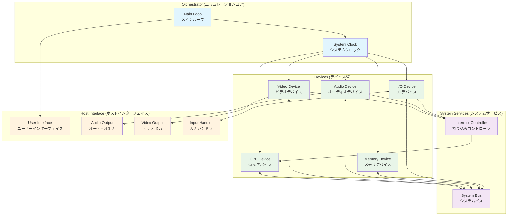
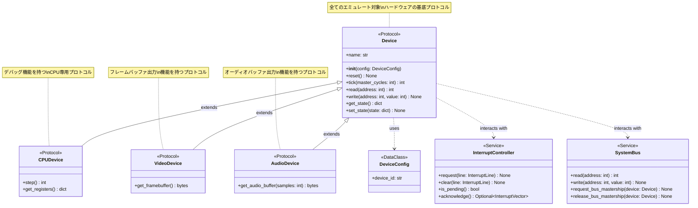
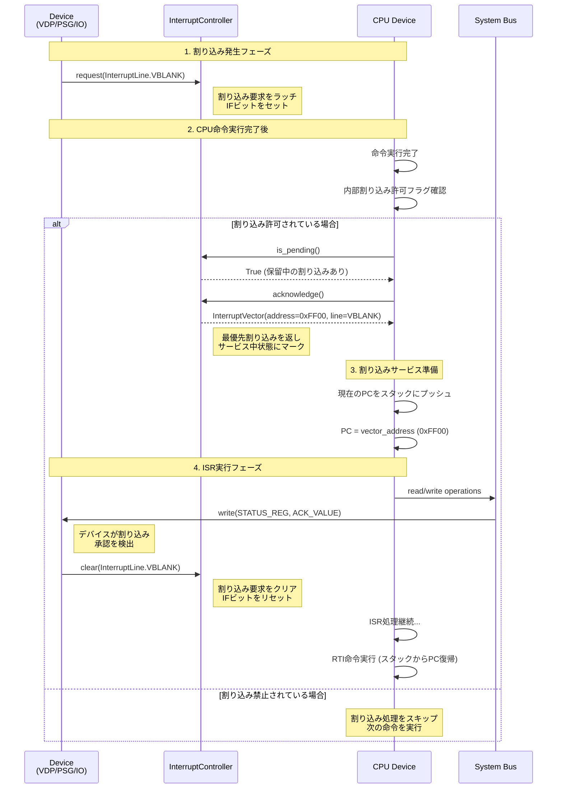
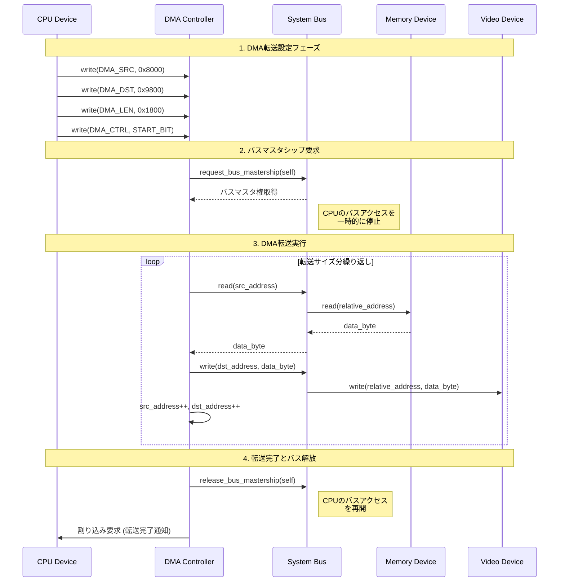

# Pythonエミュレータ向けデバイスインターフェイスAPI要件定義書

## 目次

1. [アーキテクチャのビジョンと基本原則](#10-アーキテクチャのビジョンと基本原則)
   - 1.1 導入と目的
   - 1.2 基本原則
   - 1.3 主要な用語定義
   - 1.4 システムアーキテクチャ概要 *(図表付き)*

2. [統一デバイスプロトコル](#20-統一デバイスプロトコル)
   - 2.1 プロトコル定義 (`Device`)
     - 2.1.1 プロトコル階層構造 *(クラス図)*
   - 2.2 ティックベース実行 (`tick`メソッド)
   - 2.3 アドレス空間との相互作用
   - 2.4 状態のシリアライズ

3. [割り込み管理サブシステム](#30-割り込み管理サブシステム)
   - 3.1 割り込みのシグナリング
   - 3.2 `InterruptController`
   - 3.3 CPUと割り込みの相互作用プロトコル
     - 3.3.1 割り込み処理シーケンス *(シーケンス図)*

4. [システムオーケストレーションとメインループ](#40-システムオーケストレーションとメインループ)
   - 4.1 デバイスの登録とシステムバス
   - 4.2 正規エミュレーションループ
     - 4.2.1 エミュレーションループフローチャート *(フローチャート)*
   - 4.3 デバイス間通信 (DMA)
     - 4.3.1 DMA転送シーケンス *(シーケンス図)*

5. [参照デバイスインターフェイスの特殊化](#50-参照デバイスインターフェイスの特殊化)
   - 5.1 CPUデバイスプロトコル (`CPUDevice`)
   - 5.2 ビデオデバイスプロトコル (`VideoDevice`)
   - 5.3 オーディオデバイスプロトコル (`AudioDevice`)

6. [付録: API形式定義](#60-付録-api形式定義)
   - 6.1 コアプロトコル
   - 6.2 データ構造
   - 6.3 列挙型
   - 6.4 API仕様表

## 1.0 アーキテクチャのビジョンと基本原則

### 1.1 導入と目的

本要件定義書は、Pythonで実装されるハードウェアエミュレータにおいて、多様なエミュレーション対象デバイスを共通のフレームワーク上で統一的に扱うための、標準化されたデバイスインターフェイスAPI（以下、本API）の仕様を定義するものである。本APIの主な目的は、エミュレータ開発におけるモジュール性、再利用性、および保守性を最大化することにある。

現代のハードウェアエミュレーションは、単なる過去のコンピュータシステムの再現にとどまらず、集積回路設計における機能検証やデバッグ、複雑なシステム挙動の解析など、多岐にわたる分野で利用されている [1]。これらの目的を達成するためには、エミュレータが正確かつ信頼性の高い動作をすることが不可欠である。本APIは、CPU、ビデオプロセッサ、サウンドジェネレータといった機能的に全く異なるデバイスコンポーネントを、明確に定義された規約（プロトコル）に基づいて統合するための基盤を提供する。これにより、開発者は特定のデバイスの実装に集中でき、システム全体の統合に伴う複雑さを大幅に軽減できる。例えば、新しいサウンドチップのデバイスを実装した場合、本APIに準拠していれば、既存のシステムへ最小限の労力で組み込むことが可能となる。

最終的に、本APIは、個々のデバイス実装とエミュレータの実行コア（オーケストレータ）との間の関心を明確に分離し、堅牢で拡張性の高いエミュレーションプラットフォームの構築を促進することを目標とする。

### 1.2 基本原則

本APIの設計は、以下の3つの基本原則に基づいている。これらの原則は、APIの全ての側面において遵守されなければならない。

#### 1.2.1 分離の原則 (Principle of Decoupling)

各デバイスは、自己完結したコンポーネントとして実装されなければならない（MUST）。デバイスの内部ロジックは、他の特定のデバイスに関する直接的な知識を持つべきではない（SHOULD NOT）。全てのデバイス間相互作用は、本APIで定義されたインターフェイス（システムバス、割り込みコントローラなど）を介して仲介されなければならない（MUST）。

この原則は、複雑なシステムを、それぞれが独立してテスト可能な単純な部品から構築するための鍵となる。例えば、DMAコントローラは、特定のビデオチップの内部構造を知るべきではなく、システムバスに対してバスマスタ権を要求し、指定されたメモリアドレスとの間でデータを転送する、という抽象的な操作のみを行うべきである。この責務の分離により、オーケストレータ（エミュレータのメインフレームワーク）がシステム固有のバスアーキテクチャやデバイス間の調停ロジックを実装し、デバイス自体は汎用的で再利用可能なコンポーネントとなる。この設計選択は、異なるアーキテクチャを持つ複数のシステムを同じコンポーネントセットから構築する際に、絶大な効果を発揮する。

#### 1.2.2 決定性の原則 (Principle of Determinism)

与えられた初期状態と入力に対し、エミュレータの実行結果は完全に再現可能でなければならない（MUST）。この決定性は、効果的なデバッグの根幹をなす要件である。プロフェッショナルなエミュレーションシステムでは、ブレークポイントを設定して実行を停止し、内部状態を検査し、さらには時間を巻き戻して再実行する機能が提供されるが、これらはすべて決定性に基づいている [1]。

本APIの設計は、デバイスのコアロジック内において、ホストマシンのウォールクロックタイムのような非決定的な情報源への依存を禁止することで、この原則を強制する。キーボード入力やファイル読み込みといった外部世界とのインタラクションを伴うI/Oデバイスは、この原則を遵守するために特別な配慮が必要となる。例えば、キーボードからの入力は、エミュレートされたデバイスが直接ホストOSのAPIをポーリングするのではなく、ホスト側のUIレイヤーが非同期にイベントを捕捉し、タイムスタンプ付きのキューに格納する。オーケストレータは、エミュレーション時間と同期を取りながら、このキューからイベントを取り出し、適切なタイミングでデバイスに供給する。これにより、非同期な外部イベントが、エミュレーションコアにとっては同期的で決定論的な入力ストリームに変換され、実行の再現性が保証される。

#### 1.2.3 時間精度の原則 (Principle of Temporal Accuracy)

本APIは、「ティック駆動（Tick-Driven）」モデルをアーキテクチャの中核に据える。これは、エミュレートされたシステム内の時間が、「ティック」または「サイクル」と呼ばれる離散的かつ定量化可能な単位で進むことを意味する。このアプローチは、RealBoyエミュレータのような多くの高精度エミュレータで採用されており、異なるデバイス間で発生するイベントの相対的なタイミングを正確に維持するために不可欠である 。

例えば、CPUがあるビデオレジスタに値を書き込んだ場合、その効果がビデオプロセッサに現れるのは、書き込み命令が完了するまでのクロックサイクルが経過した後でなければならない。ティック駆動モデルは、システム全体で共通のマスタークロックを基準に各デバイスの状態を更新することで、このようなデバイス間の時間的依存関係を正確に再現する。この時間管理の仕組みは、ハードウェアエミュレーションの正確性を担保する上で最も重要な要素の一つである [2]。

### 1.3 主要な用語定義

本要件定義書で使用される主要な用語を以下に定義する。

  * **デバイス (Device)**: 本APIで定義される`Device`プロトコルを実装するオブジェクト。CPU、VDP（Video Display Processor）、PSG（Programmable Sound Generator）など、エミュレートされるハードウェアの一部を表現する。
  * **システムクロック (System Clock)**: エミュレートされるシステム全体のマスタークロック。全てのデバイスのタイミングは、このクロックを基準とする。
  * **ティック (Tick)**: システムクロックが時間を進めるための最小単位。通常、マスタークロックの1サイクルに相当する。
  * **システムバス (System Bus)**: システムのアドレス空間を管理し、メモリやI/Oへのアクセス要求を適切なデバイスにルーティングする論理的なエンティティ。
  * **割り込みコントローラ (Interrupt Controller)**: デバイスとCPU間の割り込み信号の管理（要求、優先度決定、応答）を行う専用のサービス。
  * **オーケストレータ (Orchestrator)**: エミュレーションのメインループを内包する最上位コンポーネント。システムクロックを駆動し、全てのデバイスの相互作用を調整する責務を負う。

### 1.4 システムアーキテクチャ概要

以下の図は、本APIによって構築されるエミュレーションシステムの全体的なアーキテクチャを示している。



この図は、本APIの3つの基本原則がどのように実装されているかを視覚的に示している：

- **分離の原則**: 各デバイスは独立したコンポーネントとして実装され、システムバスと割り込みコントローラを介してのみ相互作用する
- **決定性の原則**: システムクロックが全てのデバイスの時間進行を統一的に管理し、ホストインターフェイスが非決定的な外部入力を決定論的なイベントストリームに変換する
- **時間精度の原則**: ティック駆動モデルにより、全デバイスが共通のマスタークロックに基づいて同期的に動作する

## 2.0 統一デバイスプロトコル

本セクションでは、全てのエミュレート対象ハードウェアコンポーネントが準拠しなければならない（MUST）中心的な規約である`Device`プロトコルを規定する。

### 2.1 プロトコル定義 (`Device`)

全てのデバイスクラスが実装すべきPythonの`Protocol`を以下に定義する。このプロトコルは、デバイスのライフサイクル、状態管理、およびシステムとの基本的な相互作用を網羅する。

  * `__init__(self, config: DeviceConfig)`: コンストラクタは、デバイス固有の設定を保持する`DeviceConfig`オブジェクトを受け取らなければならない（MUST）。このパターンは、Android Virtual Device（AVD）の設定管理に倣ったものであり、メモリサイズやクロック周波数といったデバイスの特性をコードにハードコーディングするのではなく、外部から動的に定義することを可能にする 。これにより、同じデバイスクラスから異なるバリエーションのインスタンスを容易に生成できる。
  * `reset(self)`: デバイスを初期の電源投入状態にリセットするメソッド。エミュレーションを再起動する際に、デバイスのインスタンスを再生成することなく、クリーンな状態から開始するために不可欠である。

### 2.1.1 プロトコル階層構造

以下のクラス図は、`Device`プロトコルとその特殊化されたプロトコルの階層構造を示している。



この階層構造により、以下の利点が実現される：

- **基本機能の統一**: 全てのデバイスが共通の`Device`プロトコルを実装することで、オーケストレータは統一的な方法でデバイスを管理できる
- **特殊化の柔軟性**: 各デバイスタイプ固有の機能（CPUのデバッグ、ビデオの描画など）を専用プロトコルで拡張できる
- **型安全性**: Pythonの型ヒントシステムと組み合わせることで、コンパイル時にプロトコル準拠を検証できる

### 2.2 ティックベース実行 (`tick`メソッド)

`tick(self, master_cycles: int) -> int`: このメソッドは、デバイスの内部状態を時間的に進めるための、本APIの心臓部である。

  * **パラメータ**: `master_cycles`は、前回の`tick`メソッド呼び出しから経過したシステムクロックのティック数を整数で示す。
  * **動作**: デバイスは、`master_cycles`の経過に相当する内部状態の更新を実行しなければならない（MUST）。これには、内部カウンタのインクリメント、状態機械の遷移、データの処理などが含まれる。これが「ティック駆動」アーキテクチャの具体的な実装となる 。
  * **戻り値**: メソッドは、実際に消費した`master_cycles`の数を整数で返さなければならない（MUST）。

この`tick(master_cycles) -> consumed_cycles`というシグネチャは、単純な`tick()`呼び出しよりもはるかに強力な、協調的かつサイクル精度の高いスケジューリングシステムを構築するための基盤となる。その理由は以下の通りである。
第一に、CPUのようなデバイスでは、命令によって実行サイクル数が異なる。単純な`tick()`では、各デバイスが固定サイクル数で動作することを前提としてしまい、可変サイクル長の命令を正確にエミュレートできない。
第二に、オーケストレータのメインループは、CPU命令の実行にかかるサイクル数を事前に知ることができない。
そこで、CPUの`tick`メソッドが実際に消費したサイクル数を返すことで、オーケストレータはその値を現在のタイムスライスから減算し、残りのサイクルを他のペリフェラルデバイスに分配することができる。これにより、高速な命令を実行した後はペリフェラルがより多くの時間を割り当てられ、低速な命令の後では少なくなる、という実際のハードウェアの挙動を忠実に再現することが可能になる。これは、エミュレーションの精度を飛躍的に向上させるための極めて重要な設計である。

#### 2.2.1 内部クロック管理

システムクロックとは異なる周波数で動作するデバイス（例：4MHzのシステムクロック上で1MHzで動作するCPU）は、`master_cycles`を基に自身の内部クロックを管理する責務を負う。本APIはシステム全体のマスタービートを提供し、各デバイスはそれに合わせて自身の内部リズムを刻む。例えば、4MHzのシステムクロックに対し1MHzで動作するデバイスは、`master_cycles`を4で割った値が、自身の内部クロックサイクル数となる。

### 2.3 アドレス空間との相互作用

システムのアドレス空間にマップされるデバイスは、データの読み書きのためのメソッドを実装しなければならない（MUST）。

  * `read(self, address: int) -> int`: デバイスに割り当てられたメモリマップ領域内の、指定された相対アドレスから1バイトを読み出す。
  * `write(self, address: int, value: int)`: デバイスに割り当てられたメモリマップ領域内の、指定された相対アドレスに1バイトを書き込む。

これらのメソッドが受け取る`address`は、デバイスの基底アドレスからのオフセット（相対アドレス）である。システムバスは、CPUなどが発行したグローバルなシステムアドレスを、対象デバイスとそのデバイス内での相対アドレスに変換した上で、これらのメソッドを呼び出す責務を負う。この設計により、デバイスの実装は、自身がシステム全体のメモリマップのどこに配置されているかを意識する必要がなくなり、シンプルかつ再利用性の高いものとなる。

さらに、このデバイスの`read`/`write`メソッドとシステムバスロジックの分離は、デバイスに対して透過的な形で高度なメモリ機能を実現する強力な抽象化レイヤーを提供する。システムバスは、単なる呼び出しのルーティングだけでなく、メモリバンキング（バンク切り替え）、特定メモリ領域への書き込みを監視するデバッグ機能、あるいはセーブステートのためのコピーオンライト（Copy-on-Write）といった、システムレベルの機能を実装できる。デバイスはこれらの機能の存在を一切知ることなく、システムバスを介して他のコンポーネントと相互作用できる。

### 2.4 状態のシリアライズ

セーブステート、スナップショット、決定論的なデバッグといった機能をサポートするため、全てのデバイスは自身の内部状態をシリアライズ可能でなければならない（MUST） 。

  * `get_state(self) -> dict`: デバイスの完全な内部状態（全レジスタ、内部メモリ、内部カウンタなど）を含む辞書（`dict`）を返す。状態を構成する値は、`int`, `str`, `list`, `dict`といった、シリアライズが容易なPythonの基本型でなければならない。
  * `set_state(self, state: dict)`: `get_state`で保存された辞書から、デバイスの内部状態を完全に復元する。

状態のシリアライズ形式をPythonのネイティブな`dict`型に標準化することは、戦略的な設計選択である。これにより、APIは`pickle`や`json`といった特定のシリアライズライブラリに結合されることなく、それら全てのライブラリと普遍的に互換性を保つことができる。開発者は、`get_state`が返す辞書を、アプリケーションの要件に応じて任意の形式（可読性を重視するならJSON、速度とサイズを重視するならMessagePackなど）で永続化できる。このアプローチは、デバイスの実装とアプリケーションのストレージ戦略を完全に分離する。また、`dict`形式は人間が読めるため、デバッグ時に状態を検査する際にも非常に有用である。

## 3.0 割り込み管理サブシステム

本セクションでは、デバイス間の通信と同期において極めて重要な役割を果たすハードウェア割り込みを、集中的かつ標準化されたメカニズムで処理するためのサブシステムを定義する 。

### 3.1 割り込みのシグナリング

本APIは、割り込み線を表現するための標準的な識別子（例：`Enum`型）を定義する。割り込みを生成する能力を持つデバイスは、初期化時に`InterruptController`のインスタンスへの参照を与えられなければならない（MUST）。

  * `InterruptController.request(self, line: InterruptLine)`: デバイスが割り込み要求をアサート（発生）させるために呼び出すメソッド。
  * `InterruptController.clear(self, line: InterruptLine)`: デバイスが割り込み要求をデアサート（クリア）するために呼び出すメソッド。これは通常、CPUが割り込みを承認し、特定のデバイスレジスタに書き込みを行った結果として、デバイス自身によって呼び出される。

### 3.2 `InterruptController`

`InterruptController`は、個別の`Device`ではなく、システム全体で唯一の、割り込み状態を一元管理する中央サービスである。その設計は、多くの実ハードウェアやエミュレータに見られる、割り込みマスターイネーブル（IME: Interrupt Master Enable）、割り込みイネーブル（IE: Interrupt Enable）、割り込みフラグ（IF: Interrupt Flag）レジスタのパターンをモデルとする 。

#### 3.2.1 CPU向けのAPI

CPUデバイスが割り込みを処理するために使用するインターフェイスを以下に定義する。

  * `is_pending(self) -> bool`: 現在、有効化（IEで許可）されている割り込みのうち、いずれかが要求（IFがセット）されている場合に`True`を返す。CPUは、命令実行後にこのメソッドをポーリングする。
  * `acknowledge(self) -> Optional[InterruptVector]`: 割り込みが保留中の場合、最も優先度の高い割り込みに関する情報（例：割り込みベクタアドレス）を`InterruptVector`オブジェクトとして返し、内部的にその割り込みを「サービス中」の状態にマークする。保留中の割り込みがない場合は`None`を返す。このメソッドを呼び出すのはCPUの責務である。

#### 3.2.2 設定

`InterruptController`は、固定優先度順、ラウンドロビンなど、エミュレート対象システムのアーキテクチャに応じた異なる優先度解決スキームをサポートするよう、設定可能でなければならない（MUST）。

割り込みロジックを`InterruptController`に集中させることで、CPUはペリフェラルデバイスから完全に分離される。CPUは、どのデバイスがどの割り込みを生成する可能性があるかを知る必要がなく、抽象化された割り込みコントローラとのみ通信する。例えば、エミュレータの起動時に、「割り込み線0はVDPから、割り込み線1はタイマーから」といったマッピングを設定ファイルから読み込み、コントローラを構成する。これにより、全く同じCPUデバイスの実装を、割り込みコントローラの設定を変更するだけで、完全に異なるアーキテクチャのシステムで再利用することが可能となり、コンポーネントの再利用性が劇的に向上する。

さらに、実際のハードウェアにおけるレベルシグナル割り込みとエッジシグナル割り込みの違いも、この`InterruptController`で管理されるべきである 。単純な`request()`/`clear()` APIは、要求がクリアされるまで信号がアクティブであり続けるレベルシグナルを暗示する。エッジシグナル（信号の立ち上がりエッジでのみ要求が発生する）をサポートするには、`request()`が呼び出された際にコントローラが内部的に要求をラッチ（IFビットをセット）し、即座に信号線自体は非アクティブになる、といった挙動を模倣する必要がある。したがって、本APIは、`InterruptController`が割り込み線ごとにその振る舞い（レベルかエッジか）を設定できる機能を持つべきである。これにより、デバイス側の実装は単純な`request()`呼び出しのまま、システム全体の複雑さとリアリズムは中央のコントローラで管理される。

### 3.3 CPUと割り込みの相互作用プロトコル

CPUと`InterruptController`の相互作用は、以下の厳密なシーケンスに従う。このシーケンスは、セクション4.2で詳述する正規エミュレーションループの一部として文書化される。

1.  CPUデバイスは、1つの命令の実行を完了した後、自身の内部割り込み許可フラグが有効であるかを確認する。
2.  有効である場合、`InterruptController.is_pending()`メソッドを呼び出し、保留中の割り込みが存在するかを確認する。
3.  割り込みが保留中であれば、CPUは`InterruptController.acknowledge()`を呼び出す。
4.  `acknowledge()`から返された`InterruptVector`情報（例：ベクタアドレス）を使用して、CPUは割り込みサービスルーチン（ISR）の実行準備を開始する（例：現在のPCをスタックにプッシュし、ベクタアドレスにジャンプする）。
5.  エミュレートされたISRコードは、通常、割り込みを発生させたデバイスのステータスレジスタなどに書き込みを行う。
6.  この書き込みを受け取ったデバイスは、自身のロジック内で`InterruptController.clear()`を呼び出し、対応する割り込み要求を取り下げる。

### 3.3.1 割り込み処理シーケンス

以下のシーケンス図は、デバイスが割り込みを発生させてからCPUが処理を完了するまでの詳細な流れを示している。



このシーケンスは、以下の重要な設計原則を実装している：

- **非同期性と決定性の両立**: デバイスは任意のタイミングで割り込みを要求できるが、CPUは命令境界でのみ割り込みを処理する
- **優先度管理**: `InterruptController`が複数の同時割り込み要求を適切に優先順位付けして処理する
- **状態の一貫性**: 割り込み要求のラッチとクリアが適切に管理され、割り込みの取りこぼしや重複処理を防ぐ

## 4.0 システムオーケストレーションとメインループ

本セクションでは、本APIによって管理される個々のデバイスが、どのようにして機能するシステムとして構成され、メインエミュレーションループによって駆動されるかを記述する。

### 4.1 デバイスの登録とシステムバス

オーケストレータは、デバイスの設定情報からデバイスインスタンスを生成し、システムに登録するメカニズムを提供しなければならない（MUST）。このプロセスは、Android StudioがAVD（Android Virtual Device）をハードウェアプロファイルとシステムイメージから作成するフローと類似している 。

オーケストレータは、`SystemBus`オブジェクトを維持管理する責務を負う。初期化プロセス中に、オーケストレータは各デバイスをシステムバス上の1つ以上のアドレス範囲にマッピングする。`SystemBus`オブジェクトは、CPUや他のバスマスタ（例：DMAコントローラ）からの`read`および`write`呼び出しを受け取り、アドレスに基づいて適切なデバイスの対応するメソッドにルーティングする役割を担う。

### 4.2 正規エミュレーションループ

これは、エミュレータのコアを構成する、規定された一連の操作シーケンスである。これは、ハードウェアの実際の動作サイクルをソフトウェアで忠実に実装したものである 。ループは、タイムスライス（例えば、ビデオフレーム1枚分の期間）ごとに、以下のステップをこの順序で正確に実行しなければならない（MUST）。

1.  **スライスあたりのサイクル数を決定**: このイテレーションで実行するシステムクロックの総サイクル数を計算する（例：60Hzのビデオフレームレートと3.5MHzのシステムクロックであれば、1フレームあたり約58333サイクル）。
2.  **CPUサイクルの実行**: CPUデバイスの`tick`メソッドを、スライス内の残りサイクル数を引数として呼び出す。CPUは1つ以上の命令を実行し、実際に消費したサイクル数を返す。
3.  **システム時間の更新**: CPUが消費したサイクル数を、スライスの残りサイクル数から減算する。
4.  **ペリフェラルデバイスのティック**: CPU以外の全てのデバイスをイテレートし、それぞれの`tick`メソッドを、CPUが消費したサイクル数を引数として呼び出す。これにより、ペリフェラルデバイスの状態がCPUの実行と歩調を合わせて更新される。
5.  **割り込みの処理**: CPU命令の実行が完了し、ペリフェラルデバイスのティックも完了した後、CPUデバイスは`InterruptController`をチェックし、保留中の割り込みを確認する。割り込みがサービスされるべき場合、CPUはループの*次*のイテレーションでISRにジャンプするための準備を行う。
6.  **繰り返し**: スライス内の全サイクルが消費されるまで、ステップ2から5を繰り返す。
7.  **ホストとの同期**: スライスが完了した後（例：ビデオフレームの終端）、ホストシステムとの同期処理を行う。これには、フレームバッファの画面への描画、オーディオバッファの再生、ホストからの入力イベントの処理などが含まれる。

このループにおける操作の順序は任意ではなく、エミュレーションの精度にとって極めて重要である。特に、CPUの`tick`の後にペリフェラルの`tick`を実行する順序は、最も一般的で正確なモデルである。CPU命令がペリフェラルレジスタに書き込みを行った場合、その書き込みの効果は、その命令の実行サイクルが経過した後にペリフェラルに反映されるべきである。上記のループ構造はこれを保証する。CPUの`tick`が書き込み命令を実行してNサイクルを消費し、その直後にペリフェラルの`tick`がNサイクルを引数として呼び出される。これにより、ペリフェラルは自身の状態更新の中で、CPUによる書き込みの直後の結果を処理できる。もし順序が逆であれば、ペリフェラルは1命令古い状態に基づいて動作することになり、これは微妙で発見が困難なエミュレーションバグの原因となる。

また、「タイムスライス」という概念は、精度とパフォーマンスのバランスを取るための実用的な最適化である。1システムクロックサイクルごとにループを回すのが最も正確だが、Pythonのような高水準言語では、ループと関数呼び出しのオーバーヘッドが実際の処理時間を支配し、極端に低速になる。1フレーム分のサイクルをまとめて実行し、その後でホストOSと同期する「フレームベースのスライシング」は、このオーバーヘッドを大幅に削減する。本APIの`tick`メソッドがサイクル数を引数に取る設計は、このような任意のサイズのチャンクでの実行を自然にサポートしており、ベストプラクティスとして推奨されるべきである。

### 4.2.1 エミュレーションループフローチャート

以下のフローチャートは、正規エミュレーションループの詳細な処理手順を視覚的に示している。

```mermaid
flowchart TD
    A[エミュレーション開始] --> B[タイムスライス開始<br/>remaining_cycles = SLICE_SIZE]
    
    B --> C{remaining_cycles > 0?}
    C -->|No| M[ホスト同期処理]
    C -->|Yes| D[CPU.tick&#40;remaining_cycles&#41;]
    
    D --> E[consumed = CPU戻り値]
    E --> F[remaining_cycles -= consumed]
    F --> G[システム時間更新]
    
    G --> H[ペリフェラルデバイス処理開始]
    H --> I[各デバイス.tick&#40;consumed&#41;]
    
    I --> J[CPU割り込み許可確認]
    J --> K{割り込み許可?}
    
    K -->|No| C
    K -->|Yes| L[InterruptController.is_pending&#40;&#41;]
    
    L --> N{割り込み保留中?}
    N -->|No| C
    N -->|Yes| O[InterruptController.acknowledge&#40;&#41;]
    
    O --> P[CPUに割り込みベクタ設定]
    P --> Q[次回CPU.tick時にISR実行準備]
    Q --> C
    
    M --> R[フレームバッファ描画]
    R --> S[オーディオバッファ再生]
    S --> T[入力イベント処理]
    T --> U{エミュレーション継続?}
    
    U -->|Yes| B
    U -->|No| V[エミュレーション終了]
    
    %% スタイリング
    classDef cpuProcess fill:#e3f2fd
    classDef peripheralProcess fill:#e8f5e8
    classDef interruptProcess fill:#fff3e0
    classDef hostProcess fill:#fce4ec
    classDef decision fill:#f3e5f5
    
    class D,E,F,G cpuProcess
    class H,I peripheralProcess
    class J,K,L,N,O,P,Q interruptProcess
    class M,R,S,T hostProcess
    class C,K,N,U decision
```



このフローチャートが示す重要なポイント：

- **順序の重要性**: CPU処理 → ペリフェラル処理 → 割り込み処理の順序が、ハードウェアの実際の動作を正確に模倣する
- **サイクル精度**: 各ステップで消費されたサイクル数が正確に追跡され、時間的整合性が保たれる
- **決定論的実行**: 全ての分岐条件が内部状態に基づいており、外部の非決定的要素は排除されている
- **効率的なバッチ処理**: タイムスライス単位での処理により、関数呼び出しオーバーヘッドを最小化している

### 4.3 デバイス間通信 (DMA)

CPUを介さずにデバイス間で直接データを転送するダイレクトメモリアクセス（DMA）のような高度な通信を実現するため、本APIは、デバイスがシステムバスの制御権（バスマスタシップ）を要求するためのメカニズムを提供しなければならない（MUST）。

`SystemBus`オブジェクトは、`request_bus_mastership(device)`や`release_bus_mastership(device)`といったメソッドを持つ。あるデバイスがバスマスタである間、そのデバイスから発行された`read`/`write`操作は、システムバスによって直接処理され、他のデバイスやメインメモリとのデータ転送が可能になる。この間、CPUは通常バスアクセスを停止させられる（ホールト状態）。

### 4.3.1 DMA転送シーケンス

以下の図は、DMAコントローラがバスマスタシップを取得してデータ転送を行う典型的なシーケンスを示している。



このDMA実装により実現される利点：

- **CPU負荷軽減**: 大量のデータ転送をCPUが直接実行する必要がなくなる
- **転送効率向上**: 専用ハードウェアによる最適化された転送パターンを実現
- **リアルタイム性**: ビデオフレームバッファの更新など、時間制約のある処理に対応

## 5.0 参照デバイスインターフェイスの特殊化

本セクションでは、ベースとなる`Device`プロトコルを継承し、一般的なハードウェアクラスに特化したインターフェイスを標準化するための、具体的なプロトコルの例を示す。

### 5.1 CPUデバイスプロトコル (`CPUDevice`)

`Device`プロトコルを継承し、システムの主要なコントローラとしてのCPUの役割に特化したメソッドを追加する。

  * `step(self) -> int`: `tick`メソッドの代替として、デバッガが使用することを想定したメソッド。単一の命令を実行し、消費したサイクル数を返す。
  * `get_registers(self) -> dict`: デバッグ目的で、CPUの内部レジスタ（プログラムカウンタ、スタックポインタ、アキュムレータなど）を構造化された形式で提供する。

CPUの実装は、命令やデータをフェッチするためにシステムバスと相互作用し、3.3で記述されたプロトコルに従って`InterruptController`と相互作用する責務を負う。

### 5.2 ビデオデバイスプロトコル (`VideoDevice`)

`Device`プロトコルを継承し、エミュレータがグラフィカルな出力を取得する方法を標準化する。

  * `get_framebuffer(self) -> bytes`: 現在のビデオフレームを、生のバイトバッファとして返す。ピクセルフォーマット（例：RGB24, RGBA32）は、デバイスの設定の一部として定義されるべきである。このメソッドは、エミュレーションコアとホストのUIツールキット（SDL, Qt, etc.）を分離するために不可欠である [3]。

デバイスの`tick`メソッドは、スキャンラインの進行、V-Blank（垂直帰線消去期間）やH-Blank（水平帰線消去期間）割り込みの`InterruptController`への通知など、内部のタイミングロジックを管理する責務を負う 。

### 5.3 オーディオデバイスプロトコル (`AudioDevice`)

`Device`プロトコルを継承し、エミュレータが生成されたオーディオを取得する方法を標準化する。

  * `get_audio_buffer(self, samples: int) -> bytes`: 生成されたオーディオサンプルのバッファを返す。フォーマット（例：16ビット符号付きステレオ）は、デバイス設定の一部であるべきである。
  * デバイスの`tick`メソッドは、内部のオシレータやエンベロープジェネレータを更新する。ピッチがずれないように、システムクロックと整合性の取れたレートでオーディオを生成しなければならない。特定のサンプリングレートの必要性は、多くのエミュレーションの文脈で強調されている 。

これらの特殊化されたプロトコルを定義することは、本APIを中心とした豊かなエコシステムを構築するための重要なステップである。これにより、`CPUDevice`プロトコルを実装する任意のCPUで動作する汎用デバッガや、`VideoDevice`プロトコルを実装する任意のビデオチップで動作するスクリーンレコーダーといった、汎用的なツールの開発が可能になる。例えば、デバッガは、対象デバイスが`CPUDevice`プロトコルを実装しているかを確認し、そうであれば`get_registers`メソッドを呼び出してレジスタ状態を表示できる。これにより、ツールは特定のCPU（6502, Z80など）の実装詳細に依存する必要がなくなり、コアエミュレーションと周辺ツール群との間にクリーンな関心の分離が促進される。

## 6.0 付録: API形式定義

本セクションは、Pythonの型ヒント、`Protocol`定義、およびデータ構造の仕様を含む、最終的な技術リファレンスとして機能する。

### 6.1 コアプロトコル

`typing.Protocol`を使用した`Device`, `CPUDevice`, `VideoDevice`, `AudioDevice`の完全なコードレベルの定義。python
from typing import Protocol, Dict, Any, Optional, List

class Device(Protocol):
"""
全てのエミュレート対象デバイスが実装すべき基本プロトコル。
"""
@property
def name(self) -\> str:
"""デバイスの人間が読める名前。"""
...

```
def __init__(self, config: 'DeviceConfig'):
    """デバイスを初期化する。"""
  ...

def reset(self) -> None:
    """デバイスをパワーオンリセット状態にする。"""
  ...

def tick(self, master_cycles: int) -> int:
    """
    指定されたマスターサイクル数だけデバイスの状態を進め、
    実際に消費したサイクル数を返す。
    """
  ...

def read(self, address: int) -> int:
    """
    デバイスのメモリマップ空間から1バイトを読み出す。
    addressはデバイスのベースアドレスからのオフセット。
    """
  ...

def write(self, address: int, value: int) -> None:
    """
    デバイスのメモリマップ空間に1バイトを書き込む。
    addressはデバイスのベースアドレスからのオフセット。
    """
  ...

def get_state(self) -> Dict[str, Any]:
    """
    デバイスの現在の内部状態をシリアライズ可能な辞書として返す。
    """
  ...

def set_state(self, state: Dict[str, Any]) -> None:
    """
    辞書からデバイスの内部状態を復元する。
    """
  ...
```

````

### 6.2 データ構造

`dataclasses`や`TypedDict`を使用した主要なデータ構造の定義。

```python
from dataclasses import dataclass

@dataclass
class DeviceConfig:
    """
    デバイス設定の基底クラス。
    具体的なデバイスはこれを継承して設定項目を追加する。
    """
    device_id: str

@dataclass
class InterruptVector:
    """
    CPUに渡される割り込み情報。
    """
    vector_address: int
    line: 'InterruptLine'
````

### 6.3 列挙型

標準的な`Enum`型の定義。

```python
from enum import Enum, auto

class InterruptLine(Enum):
    """
    システム内の割り込み線を定義する列挙型。
    具体的なシステムに応じて定義される。
    例:
    VBLANK = auto()
    HBLANK = auto()
    TIMER = auto()
    """
    IRQ_0 = auto()
    IRQ_1 = auto()
    #...

class DeviceType(Enum):
    """デバイスの分類。"""
    CPU = auto()
    VIDEO = auto()
    AUDIO = auto()
    MEMORY = auto()
    IO = auto()
```

### 6.4 API仕様表

#### 表 6.1: `Device`プロトコル仕様

この表は、新しいデバイスを実装する開発者にとって、単一かつ明確なリファレンスを提供する。これはAPI全体の中心的な規約であり、実装者が自身のデバイスがAPIに準拠しているかを確認するためのチェックリストとして機能する。

| メソッド/プロパティ | シグネチャ | 戻り値の型 | 説明 |
| :------------------ | :---------------------------------------- | :-------------- | :--------------------------------------------------------------------------------------------------------------------------------------------------------------- |
| `name` | `name(self) -> str` | `str` | **MUST**実装。デバッグや識別のための、人間が読めるデバイス名を返す。 |
| `reset` | `reset(self) -> None` | `None` | **MUST**実装。デバイスを初期の電源投入状態にリセットする。 |
| `tick` | `tick(self, master_cycles: int) -> int` | `int` | **MUST**実装。指定されたマスターサイクル数だけ内部状態を進め、実際に消費したサイクル数を返す。 |
| `read` | `read(self, address: int) -> int` | `int` | **SHOULD**実装。メモリマップされるデバイスの場合、指定された相対アドレスから1バイトを読み出す。`0 <= value <= 255`の範囲でなければならない。 |
| `write` | `write(self, address: int, value: int)` | `None` | **SHOULD**実装。メモリマップされるデバイスの場合、指定された相対アドレスに1バイトを書き込む。`0 <= value <= 255`の範囲でなければならない。 |
| `get_state` | `get_state(self) -> dict` | `dict` | **MUST**実装。セーブステートのために、デバイスの完全な内部状態をシリアライズ可能な辞書として返す。 |
| `set_state` | `set_state(self, state: dict) -> None` | `None` | **MUST**実装。`get_state`で取得した辞書から、デバイスの内部状態を完全に復元する。 |

#### 表 6.2: `InterruptController` API仕様

この表は、割り込みという重要なシステム機能の中心ハブである`InterruptController`のAPIを明確に定義する。APIの利用者がペリフェラルデバイスとCPUという2つの異なる役割を持つため、それぞれの対象者を明記することで混乱を防ぎ、開発者が共通の前提に基づいて作業できるようにする。

| メソッド | 対象者 | シグネチャ | 説明 |
| :------------------- | :----------- | :-------------------------------------------------- | :------------------------------------------------------------------------------------------------------------------------------------------------------------------ |
| `request` | デバイス | `request(self, line: InterruptLine) -> None` | **MUST**使用。指定された割り込み線をアサート（要求）する。 |
| `clear` | デバイス | `clear(self, line: InterruptLine) -> None` | **MUST**使用。指定された割り込み線をデアサート（クリア）する。通常、CPUによる割り込みACK（承認）処理の結果としてデバイスが呼び出す。 |
| `is_pending` | CPU | `is_pending(self) -> bool` | **MUST**使用。有効化されている割り込みのいずれかが現在要求されている場合に`True`を返す。CPUは命令実行後にこれをチェックする。 |
| `acknowledge` | CPU | `acknowledge(self) -> Optional[InterruptVector]` | **MUST**使用。保留中の割り込みのうち、最も優先度の高いものを処理対象として返し、内部状態を更新する。保留中の割り込みがない場合は`None`を返す。 |
